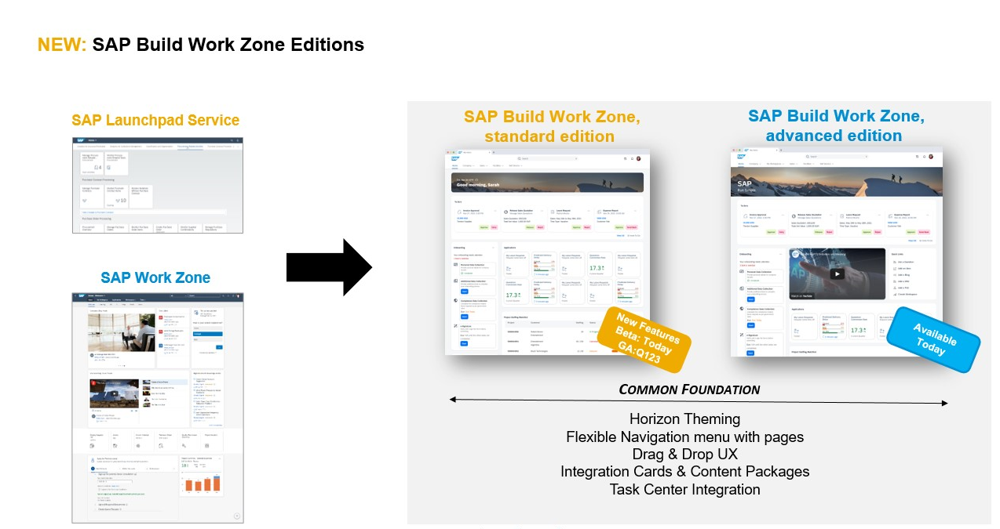
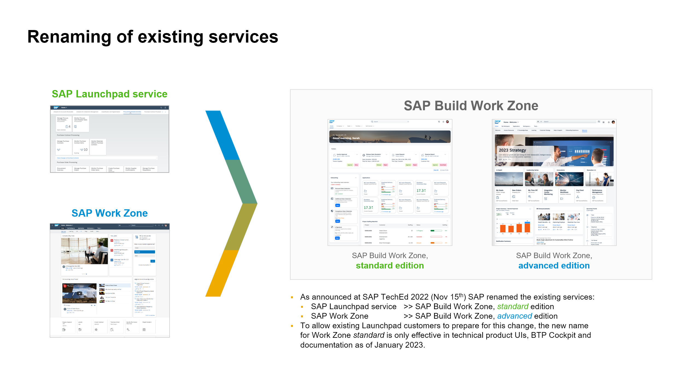

# Um Hands-On do começo ao fim sobre a configuração SAP Build Work Zone, standard edition. 

## Descrição

Este repositório contém o material para a sessão SAP BTP Experience 2023 - Um Hands-On do começo ao fim sobre a configuração SAP Build Work Zone, standard edition.

> **NOTA**: O SAP Launchpad Service faz parte do portfólio SAP Build. No início de 2023, foi lançada uma nova experiência com o  nome SAP Build Work Zone, standard edition. Você pode aprender mais no [Roadmap Explorer](https://roadmaps.sap.com/board?PRODUCT=73554900100800003081&PRODUCT=73555000100800002781&range=CURRENT-LAST#Q4%202022). 
> Esteja ciente de que algumas capturas de tela ou sistemas neste material prático ainda podem conter o antigo nome SAP Launchpad Service*. 
> 

> Nomes de produtos e mudanças anunciadas
> 

## Visão geral

Este Hands-On apresenta aos participantes a criação de um site com o SAP Build Work Zone, standard edition (anteriormente conhecido como serviço SAP Launchpad) em sua conta de avaliação gratuita. Os participantes aprenderão como consumir conteúdo federado de sistemas SAP S/4HANA e como adicionar um aplicativo personalizado desenvolvido ao site. Por fim, eles consumirão seu site no aplicativo SAP Mobile Start.

Antes de começar com os exercícios, dê uma olhada na seguinte [Visão geral do SAP Build Work Zone](intro/overview.md).

O Hands-On consiste em quatro seções principais:
1. Crie seu primeiro site e adicione um aplicativo a ele.
2. Consumir conteúdo SAP S/4HANA Business no site (esta parte será mostrada como uma demonstração, mas você pode seguir o tutorial[ Melhore seu site SAP Launchpad com conteúdo federado SAP S/4HANA](https://developers.sap.com/mission.launchpad-s4hana.html) para consumir conteúdo federado de sua própria avaliação do SAP S/4HANA sistema. Saiba mais sobre [federação de conteúdo](intro/federation.md).
3. Crie seu próprio aplicativo personalizado desenvolvido com o Business Application Studio e integre-o facilmente em seu site. Devido a limitações de tempo, você criará apenas um aplicativo muito simples durante o Hands-On. Alternativamente, você também pode fazer [este Exercicio](https://developers.sap.com/tutorials/appstudio-fioriapps-create.html) e criar um aplicativo que consome dados de um sistema de back-end. Mas observe que primeiro você precisa [criar uma conta no sistema de demonstração do SAP Gateway](https://developers.sap.com/tutorials/gateway-demo-signup.html) e, em seguida, [conectar seu teste BTP a ele](https://developers.sap.com/tutorials/cp-portal-cloud-foundry-gateway-connection.html). Isso levará cerca de 20 minutos a mais.
4. Acesse seu site com o SAP Mobile Start.

## Requisitos

Este exercício é executado em um ambiente de teste SAP BTP. Você precisa primeiro se registrar para obter sua própria conta de avaliação gratuita. Você pode se registrar em uma [conta de avaliação usando este link](https://account.hana.ondemand.com/#/home/welcome) Crie uma conta de avaliação. Role para baixo e clique em Obter avaliação agora. Para o último exercício, você também precisará de um telefone celular (iOS ou Android) capaz de executar o SAP Mobile Start.

## exercícios

- [Exercício 0 - Configure o serviço SAP Launchpad em sua conta de teste](exercises/ex0/README.md)

- Exercício 1 - Crie seu primeiro site de barra de ativação e adicione um aplicativo de URL ao site
    - [Exercício 1.1 - Crie seu primeiro site](exercises/ex1/ex1.1/README.md)
    - [Exercício 1.2 - Adicione um aplicativo ao seu site](exercises/ex1/ex1.2/README.md)

- Exercício 2 - Integrar um aplicativo SAPUI5 desenvolvido sob medida em seu site
    - [Exercício 2.1 - Configurar o SAP Business Application Studio para desenvolvimento](exercises/ex2/ex2.1/README.md)
    - [Exercício 2.2 - Criar um aplicativo SAP Fiori usando o SAP Business Application Studio](exercises/ex2/ex2.2-alternative/README.md)
    - [Exercício 2.3 - Crie e implemente seu aplicativo SAP Fiori no SAP Business Technology Platform](exercises/ex2/ex2.3/README.md)
    - [Exercício 2.4 - Integre seu aplicativo SAPUI5 ao seu site Launchpad](exercises/ex2/ex2.4/README.md)

- [Exercício 3 - Acesse seu site com o SAP Mobile Start](exercises/ex3/README.md)

## Como obter suporte

O suporte para o conteúdo deste repositório está disponível durante o hands-on para a qual este conteúdo foi projetado. Caso contrário, você pode solicitar suporte por meio da guia [Issues](../../issues) tab.