# Configurar o SAP Build Work Zone, Standard Edition (antigo SAP Launchpad Service) usando uma conta Trial

Para começar a criar um site no padrão SAP Build Work Zone, você deve executar as etapas de integração necessárias no cockpit do SAP Business Technology Platform.

## Pré-requisitos
Neste workshop, você usará o ambiente Trial. Se você ainda não possui uma conta de teste, primeiro você precisa registrá-la. Você pode encontrar uma descrição detalhada de como fazer isso neste [tutorial](https://developers.sap.com/tutorials/hcp-create-trial-account.html). Se você já possui um usuário SAP, pode acessar [SAP BTP Trial](https://account.hanatrial.ondemand.com/trial/#/home/trial), fazer login e seguir as instruções.

## Detalhes
### Você vai aprender
  - Como assinar o serviço SAP Launchpad (agora chamado SAP Build Work Zone, standard edition)
  - Como atribuir a si mesmo a `Launchpad_Admin` função para que você possa criar e gerenciar sites
  - Como acessar o ambiente de administração
  
 

### Etapa 1: Assinar o serviço

Antes de acessar e usar o serviço, primeiro você precisa se inscrever.

1. [Faça logon no SAP BTP](https://cockpit.hanatrial.ondemand.com) e Clique em **Go To Your Trial Account**.

    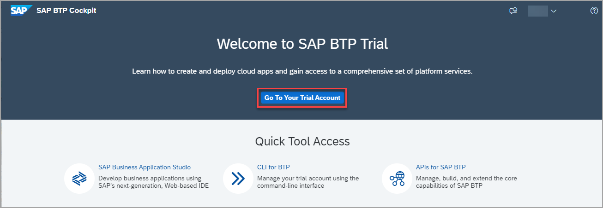

    >Se esta é a primeira vez que você acessa sua conta trial, você terá que configurar sua conta escolhendo uma região (selecione a região mais próxima de você). Seu perfil de usuário será configurado para você automaticamente. Aguarde até que sua conta esteja configurada e pronta para uso. Sua conta global, sua subconta, sua organização e seu espaço são lançados. Isso pode levar alguns minutos..  

2. Clique em **Continue** se você receber este pop-up..

    

3. Clique em  **trial** para navegar até sua subconta. Se você estiver usando sua própria subconta, poderá selecioná-la.

      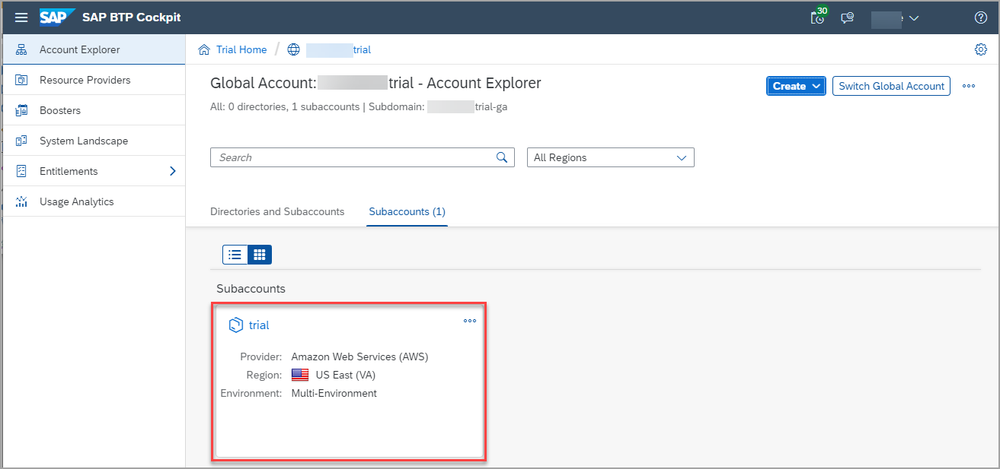
      

4. Clique em **Service Marketplace** no painel de navegação esquerdo.

    > O Service Marketplace fornece acesso a todos os serviços e aplicativos que você pode acessar a partir do cockpit SAP BTP.

    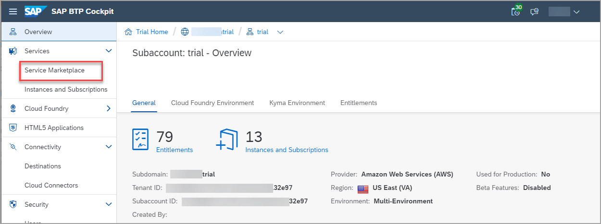
    

5. Digite `launchpad` pesquisa e clique no **Launchpad Service**.

    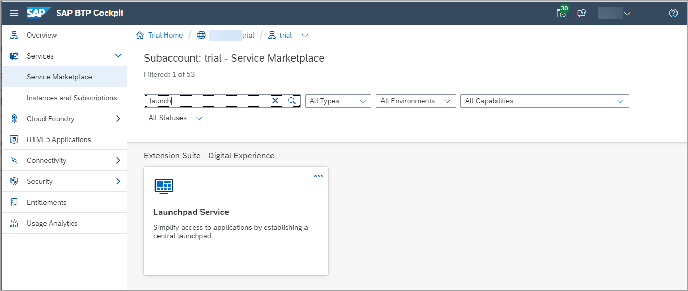    

    A página Launchpad Service é aberta com 3 guias que incluem informações sobre o serviço, bem como os dois planos diferentes.
    

6.  Clique no botão **Criar** no canto superior direito da tela.

    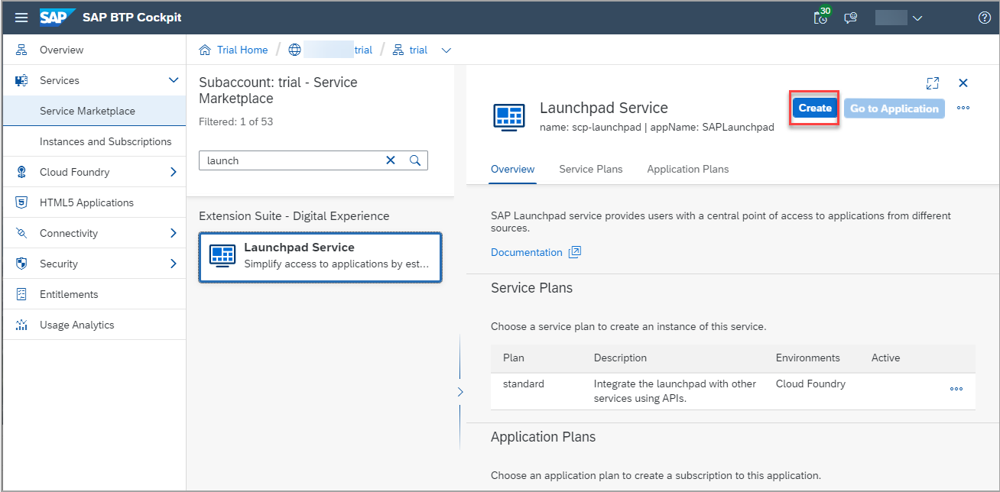

    

7. Na caixa **Nova Instância ou Assinatura** selecione o plano **standard** e clique em  **Criar**.

    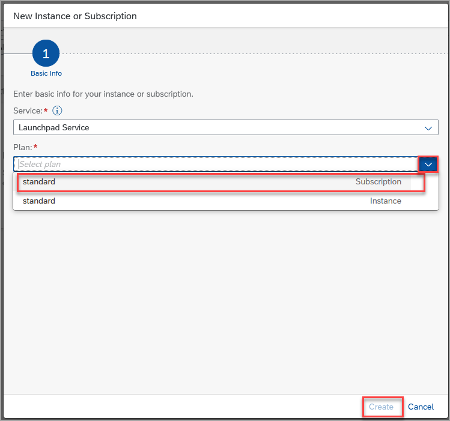
    
    >Existem dois tipos de planos padrão disponíveis. Nesse caso, você precisa criar uma assinatura para o serviço SAP Launchpad. 
    

8. Você receberá uma confirmação de que sua assinatura está sendo criada. Clique em **View Subscription**.

    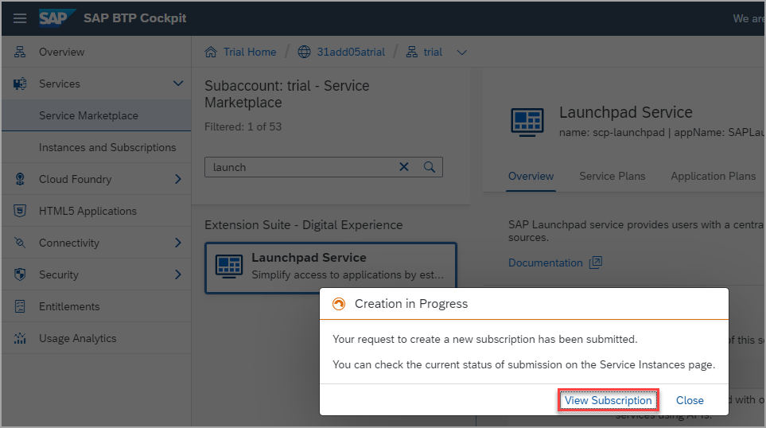

    >Esta etapa irá redirecioná-lo para a tela **Services** -> **Instances and Subscriptions**. Esta tela fornece uma visão geral de todos os serviços e aplicativos que estão ativos no momento.
    

9. Na tela **Instances and Subscriptions** , na guia  **Subscriptions** ou à direita sob o nome do serviço, aguarde até ver que você está inscrito no **Launchpad Service**.

    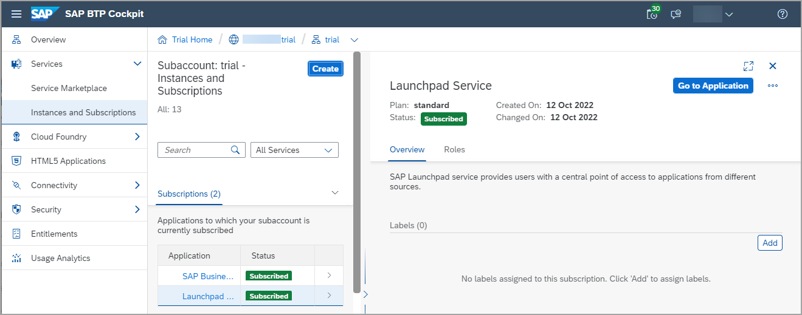

### Etapa 2: adicione-se à função Launchpad_Admin

Para poder acessar o serviço SAP Launchpad, os usuários devem ser atribuídos à `Launchpad_Admin` role. Nesta etapa, você atribuirá a si mesmo essa função para poder acessar o serviço e criar um site de barra de ativação.

1. Clique em **Security > Role Collections** no menu lateral.

      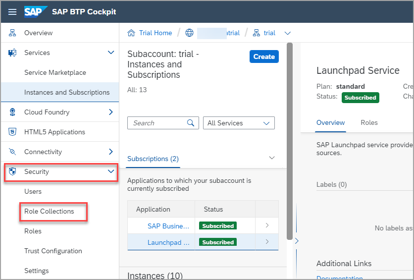
      

2. No campo Pesquisar, comece a digitar Launchpad para localizar a `Launchpad_Admin` role collection.

    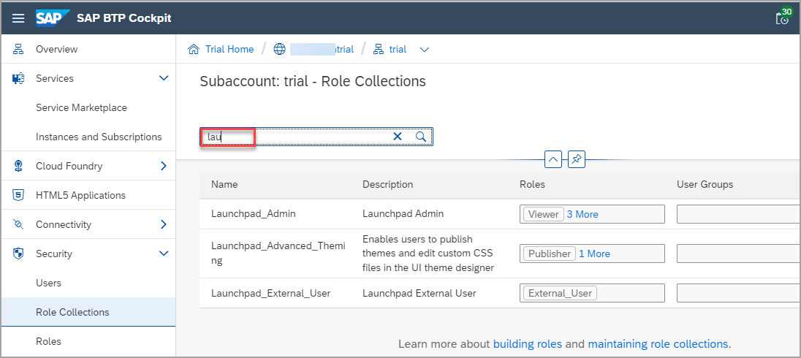
    

3. Na linha com a `Launchpad_Admin` role collection, clique na seta à direita da linha.

    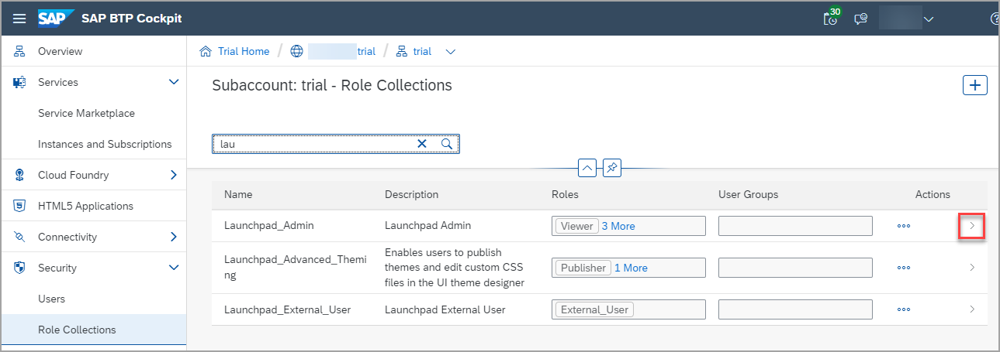

    Você pode ver todos os detalhes da  `Launchpad_Admin` role collection.
    
    > Você também pode clicar no nome da role collection para abrir seus detalhes.
    

4. Clique em **Editar**.

    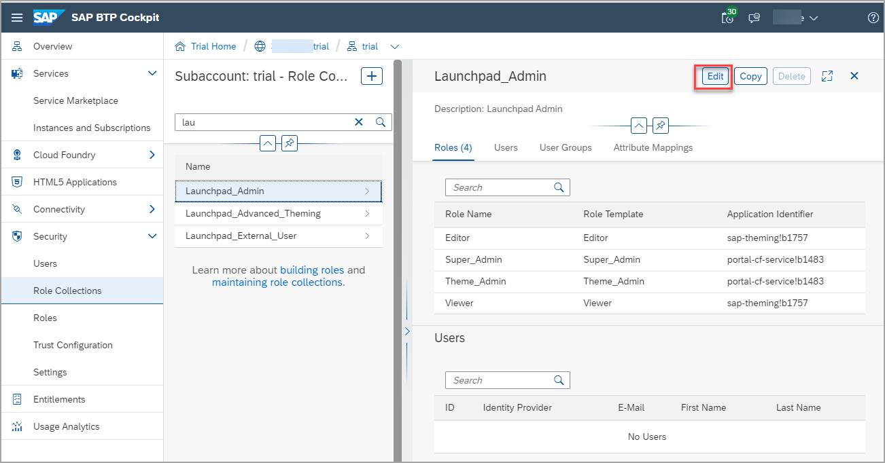
    

5. Na guia **Users** , insira seu e-mail nos campos **ID** e **E-Mail**. Em seguida, clique em **Save**.

    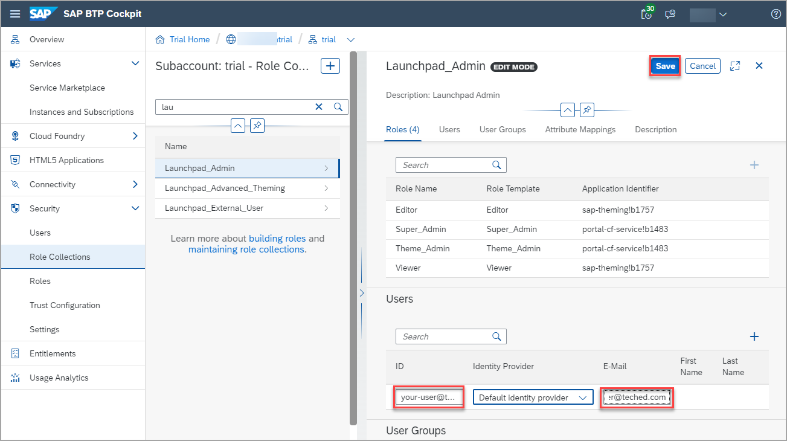

Agora você foi atribuído à `Launchpad_Admin` role collection e pode acessar o  SAP Build Work Zone, standard edition e realizar todas as suas tarefas administrativas.

### Etapa 3:  Acesse o SAP Build Work Zone standard

1. No painel lateral, clique em **Instances and Subscriptions**.

    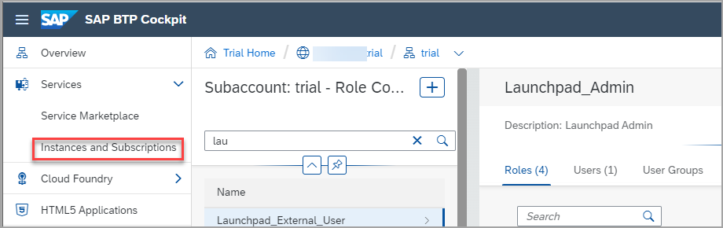
    

2. Na guia **Subscriptions** , clique no **Launchpad Service**. Você também pode clicar em **Go to Application** à direita.

    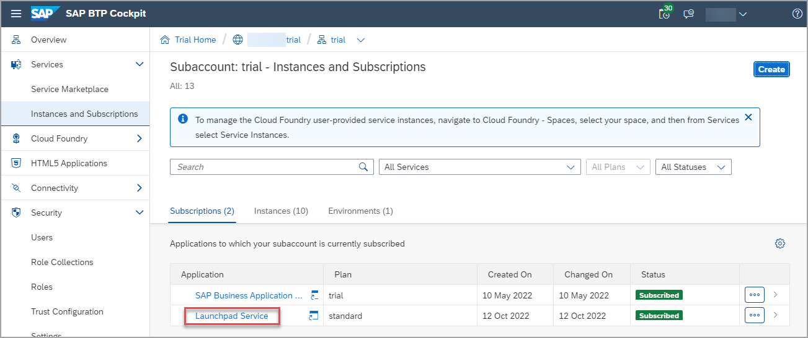

   O serviço é aberto com o Site Directory em foco. É aqui que você criará e gerenciará seus sites.
 
  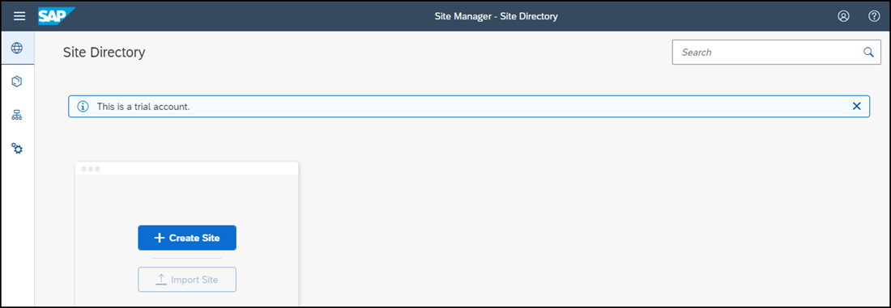

## Resumo

Agora você criou uma assinatura do SAP Build Work Zone, standard edition, e atribuiu a si mesmo a administrator role. 
 Continue para - [ Exercício 1.1 - Crie seu primeiro site ](../ex1/ex1.1/README.md)
