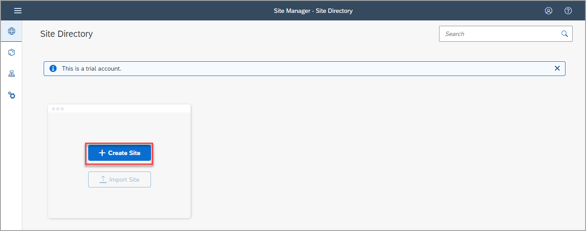
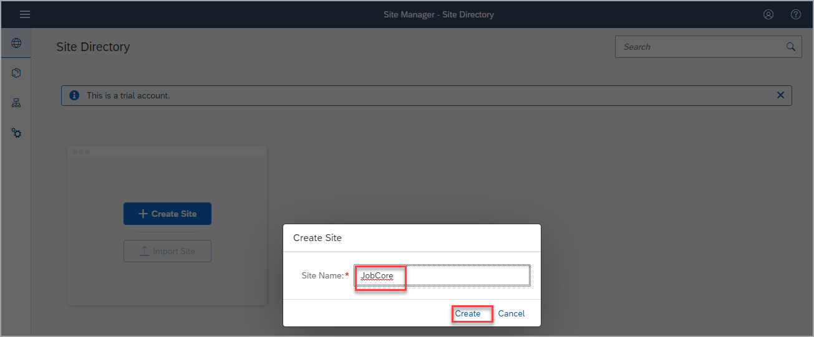
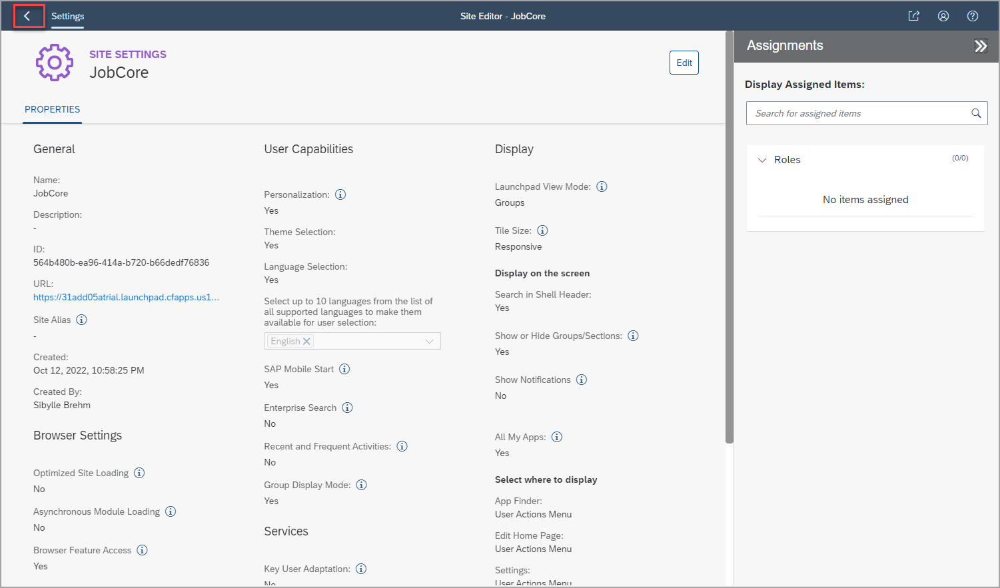

# Crie um site com o SAP Build Work Zone, standard edition

Neste tutorial, você criará um site para uma empresa de recrutamento chamada `JobCore`. . Em seguida, você adicionará um aplicativo a este site.

## Pré-requisitos
Você se inscreveu no serviço SAP Launchpad e atribuiu a si mesmo a `Launchpad_Admin` role.

 

### Etapa 1: criar um site

Quando você acessa o ambiente admin, o Site Directory está em foco. A partir daqui, você criará seu novo site.

> No painel lateral do ambiente administrativo, você vê quatro ferramentas. O **Site Directory** onde você criará um novo site. Todos os sites que você criar serão exibidos aqui. O **Content Manager** onde você gerenciará o conteúdo entre sites, como aplicativos **Channel Manager** onde você gerencia diferentes canais que expõem conteúdos de negócios que você pode integrar em seus sites. O quarto ícone abre **Settings** onde você pode definir várias configurações relacionadas ao SAP Build Work Zone, standard edition.

1. Clique em **Create Site**.

    

2. Digite `JobCore` como o nome do site e clique em **Create**.

    

Você acabou de criar um site chamado `JobCore`.

 

### Passo 2: Navegue até o Site Directory

Ao criar um site, você é direcionado para a tela **Site Settings**, onde pode editar as configurações do site e atribuir funções ao site.

> Nas configurações do site, você pode configurar vários recursos do site, por exemplo, integração com SAP Mobile Start, Enterprise Search. Você pode ativar a Adaptação do usuário principal e definir as opções que os usuários devem ter, por exemplo, se os usuários podem personalizar o site ou selecionar um tema ou um idioma.

Navegue de volta ao **Site Directory** para visualizar o site.

  

 

## Resumo

Você criou seu primeiro site. Por enquanto, o site está vazio.

Continue para - [ Exercício 1.2 - Adicionar um aplicativo ao seu site](../ex1.2/README.md) para adicionar um aplicativo a ele.

