# Adicione um aplicativo SAPUI5 ao seu site

Neste exercício, você usará o **Content Manager** para adicionar um aplicativo SAPUI5 ao seu site. Você também criará um grupo e atribuirá o aplicativo a ele.

## Pré-requisitos
 - Você já criou o `JobCore`.  

 

### Step 1:  abra o Content Manager

 Clique no ícone do Content Manager  no painel lateral para abrir o **Content Manager**.

>O  **Content Manager** tem duas guias: **My Content** , onde você pode configurar manualmente os itens de conteúdo e visualizar quaisquer outros itens de conteúdo disponíveis, e o **Content Explorer** , onde pode explorar o conteúdo exposto de canais disponíveis, selecionar o conteúdo e adicioná-lo ao seu próprio conteúdo.

  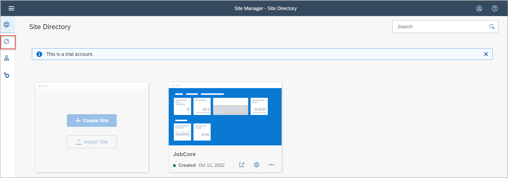

 

### Etapa 2: criar e configurar um novo aplicativo

1.  Clique em **+ New** e selecione  **App** na lista.

    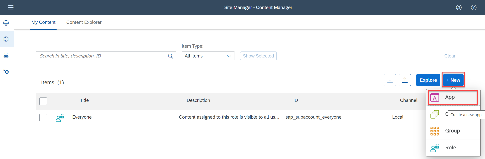

    O editor de aplicativos é aberto com a guia **PROPERTIES** tab in focus.

2. Digite os seguintes valores:

    * **Title**: `New Orders`

    * **Open App**: no lugar

    * **URL**:  `https://sapui5.hana.ondemand.com/test-resources/sap/m/demokit/cart/webapp/index.html`

    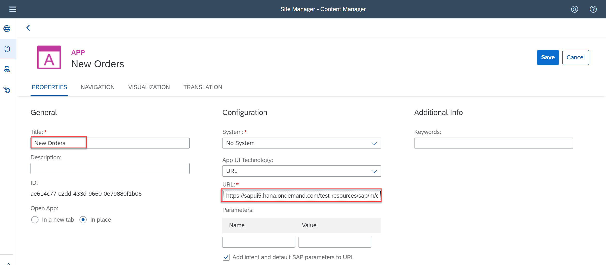

    >Ao trabalhar em seu próprio ambiente, é melhor integrar os aplicativos SAPUI5 usando o repositório de aplicativos HTML5. Essa configuração permite que você gerencie melhor seu conteúdo no ciclo de vida Dev-QA-Prod. Você verá como fazer isso no exercício 2.

3. Clique na guia **NAVIGATION** para especificar a intenção do seu aplicativo.

    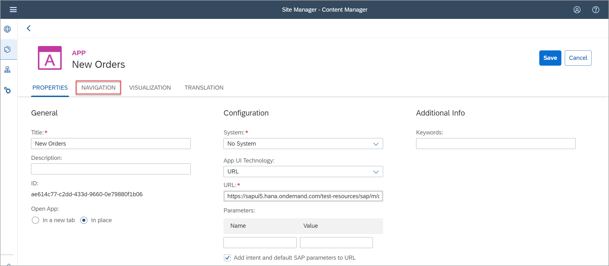

    > A combinação única de um objeto semântico e uma ação é chamada de intenção. Ele é usado para definir a navegação para um aplicativo.

4. Digite os seguintes valores:

    * **Semantic Object**: `Order`

    * **Action**: `Display`

    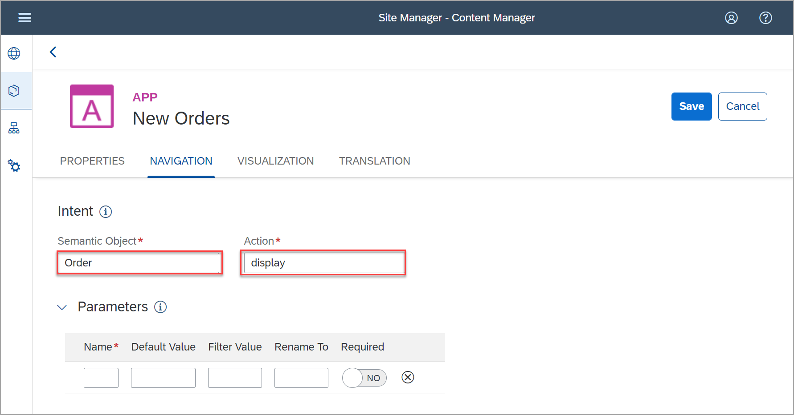

5. Clique na guia **VISUALIZATION**.

    Nesta guia, você especifica como o Tile do aplicativo será exibido no site.

6. Digite os seguintes valores:

      * **Subtitle**: `Shopping Cart `

      * **Information**:  `Order Now!`

      * **Icon**: Clique no ícone de navegação, digite `my-sales-order`, clique no ícone exibido e clique em **OK**.

      À direita, você pode ver uma visualização do bloco com todas as propriedades inseridas. Clique em **Save**.

    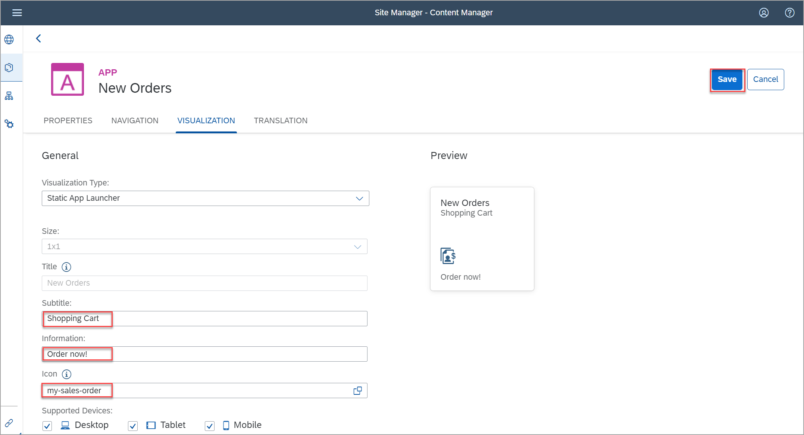

 

### Etapa 3: visualizar o aplicativo que você criou

Clique no ícone **Back** para navegar de volta ao *Content Manager*. Você também pode clicar no ícone do Content Manager no painel esquerdo.

  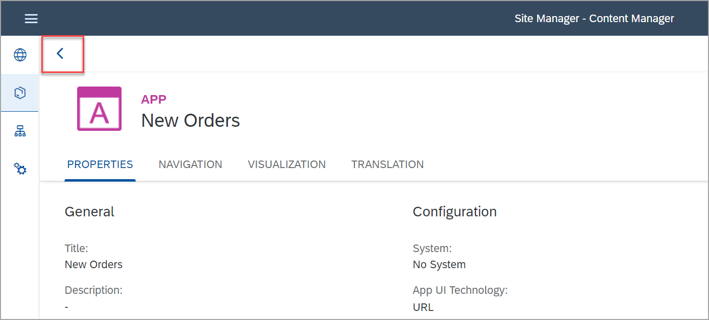

Você pode ver seu aplicativo nesta lista

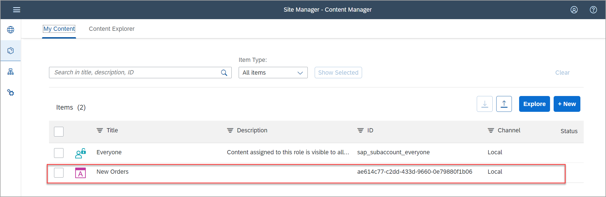

Para que os usuários finais acessem o aplicativo em tempo de execução, você deve atribuir o aplicativo a uma role.Você também precisa atribuir o aplicativo a um grupo para que fique visível no site.

 

### atribuir o aplicativo à role Everyone 

>O conteúdo atribuído à role `Everyone`  fica visível para todos os usuários. Além disso, a role `Everyone`  é atribuída por padrão a cada site.

1. Clique na role **Everyone** .

    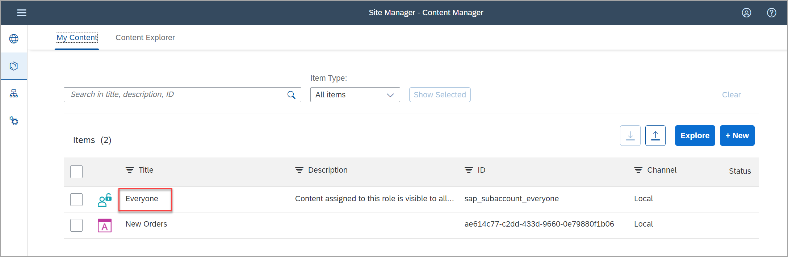

2. Clique em **Editar**.

    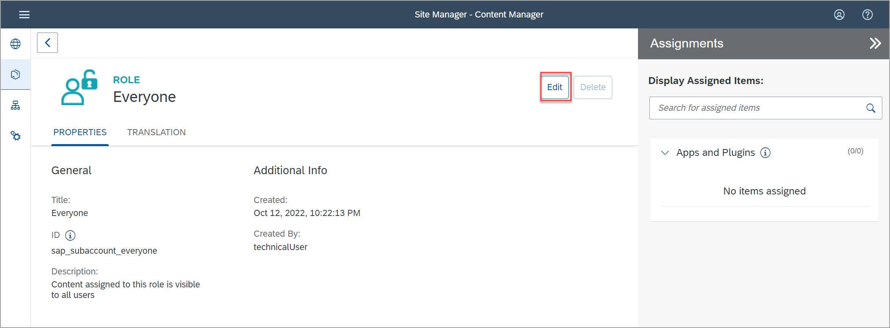

3. Clique na caixa de pesquisa no painel **Assignments** à direita. Todos os aplicativos disponíveis são mostrados na lista abaixo.   

4. Na lista **Results** , clique no ícone **+** ao lado do `New Orders` para atribuir essa role ao seu aplicativo.

    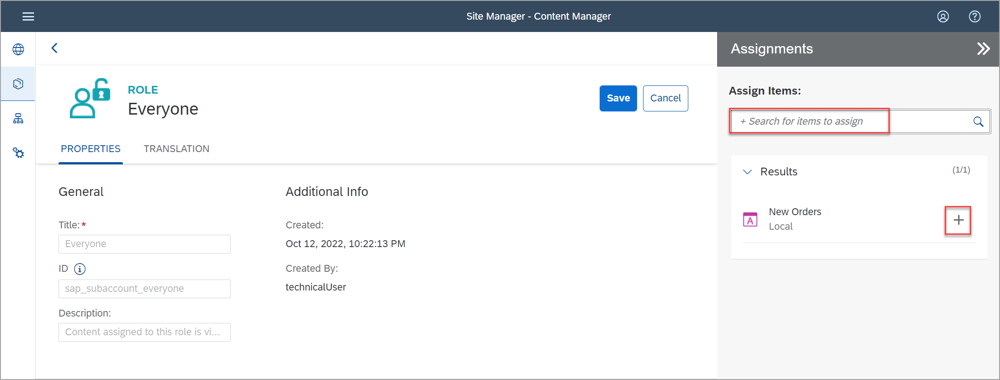    

5. Clique em **Salvar**.

    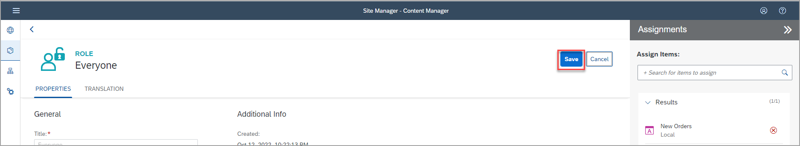
    
6. Clique no ícone **Back** para navegar de volta ao *Content Manager*. 

 

### Etapa 5: crie um grupo e atribua o aplicativo a ele

 

>Um grupo é um conjunto de um ou mais aplicativos exibidos juntos em um site da barra de ativação. A atribuição de aplicativos a grupos os torna visíveis para o usuário.
 Assigning apps to groups, makes them visible to the user.
   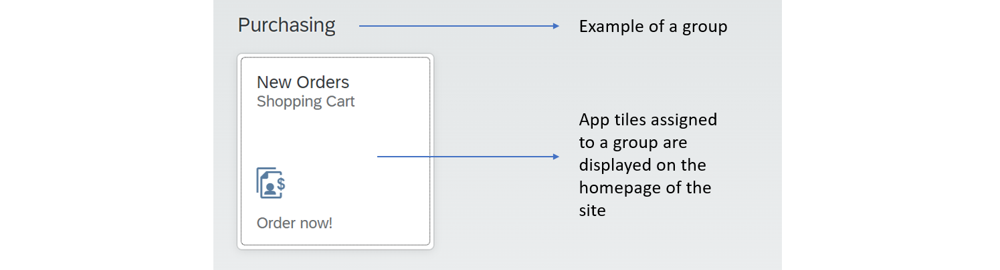
   
 

1. Clique em  **+ New** e selecione **Group** para criar um grupo.

    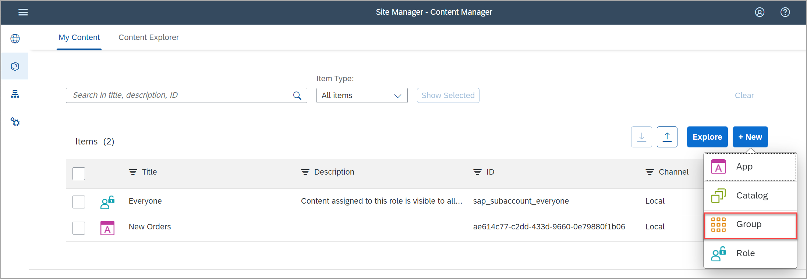

2. Digite  `Purchasing` como **Title** e no painel **Assignments** clique dentro da caixa de pesquisa à direita da tela, para mostrar todos os aplicativos disponíveis. Você deveria ver `New Orders`.

3. Na lista **Results** , clique em **+** para atribuir o  `New Orders` ao seu grupo.

    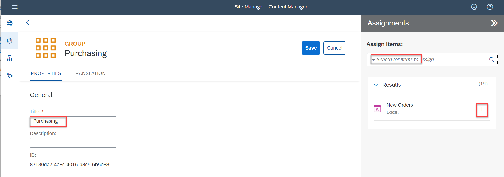

4. Clique em **Save**.

    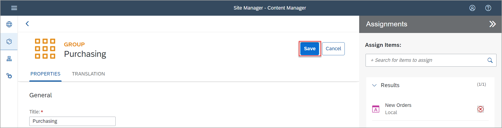

 

### Etapa 6: revise o site

1. Clique no ícone Site Directory no painel esquerdo para abrir o **Site Directory**.

    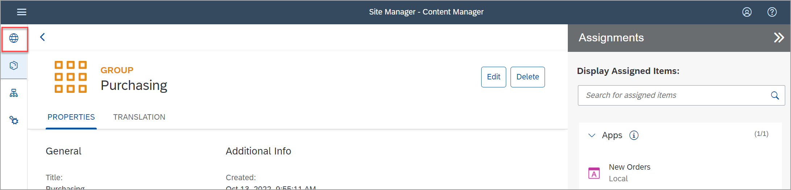

2. No tile `JobCore` , clique no ícone  **Go to site**.

    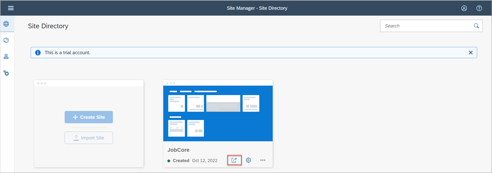

3. Isso é o que você vai ver:

    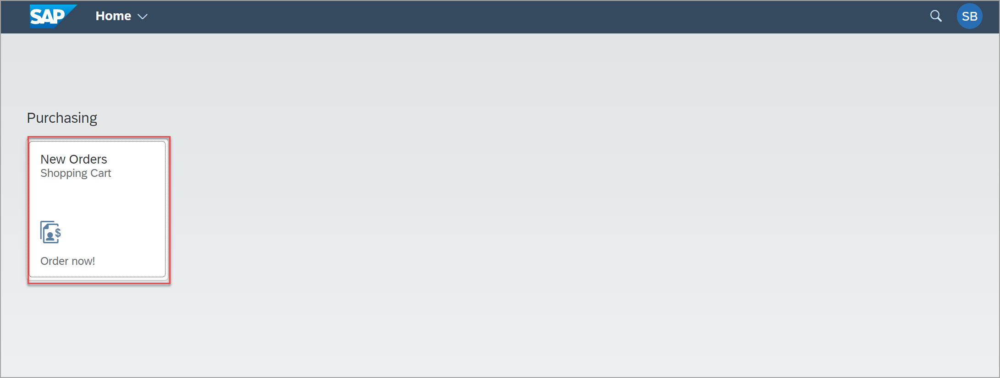

    Seu  App `New Orders` é exibido no grupo `Purchasing` .
    

4. Clique no Tile `New Orders` para iniciar o aplicativo.

   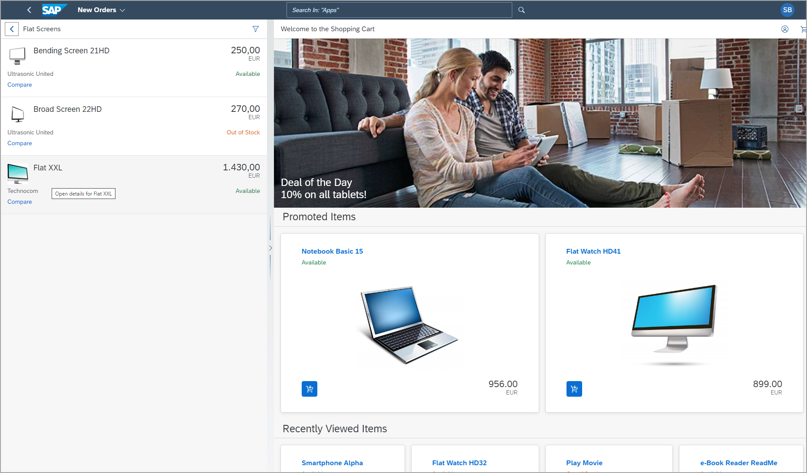

No aplicativo, clique em qualquer categoria à esquerda para ver as ofertas de produtos.

 

## Resumo

Você adicionou com sucesso um aplicativo ao seu site. Agora você verá agora uma demonstração de como consumir conteúdo federado de um sistema SAP S/4HANA Volte ao [Guia principal](../../../README.md) para saber mais sobre a federação de conteúdo.