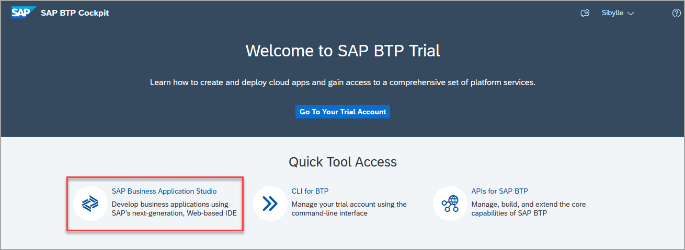
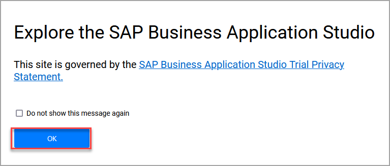
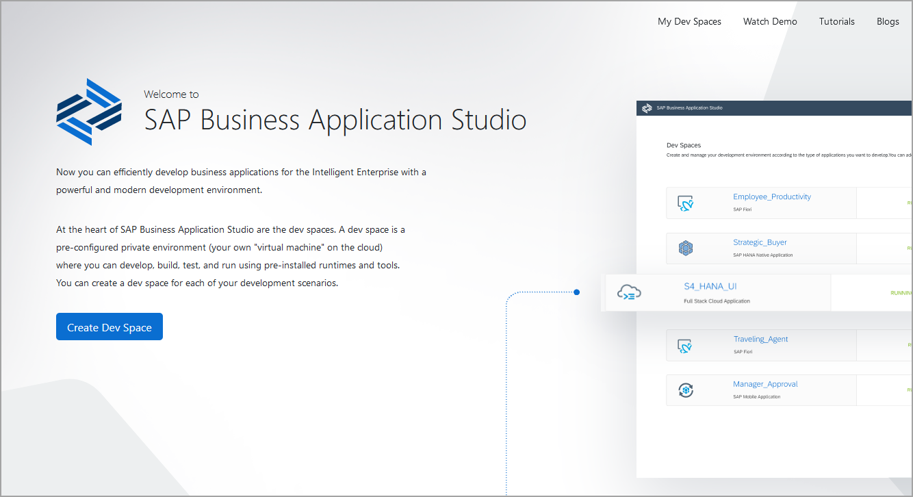
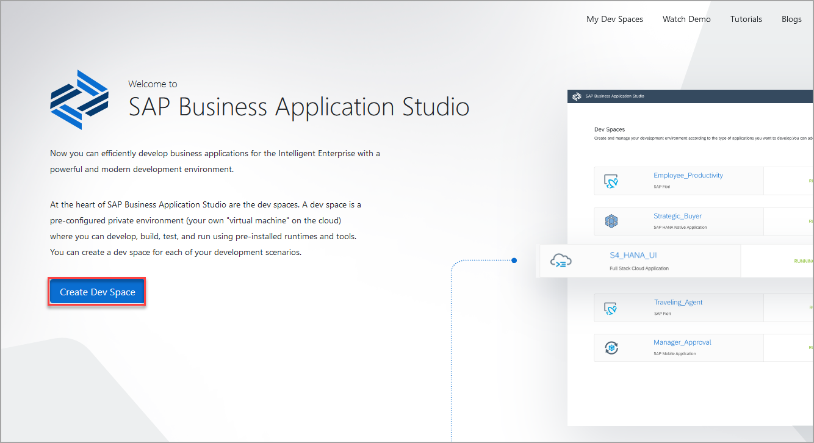
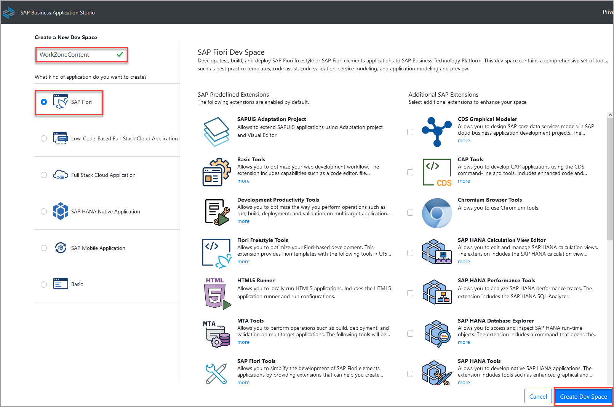
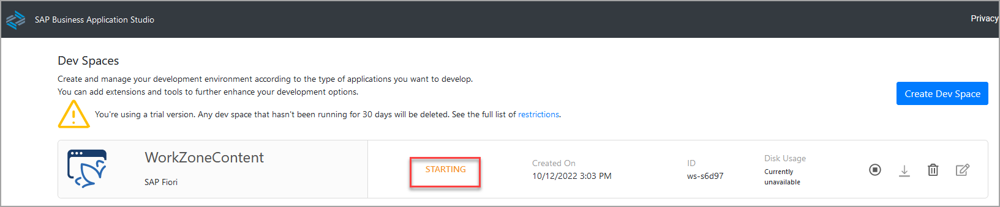
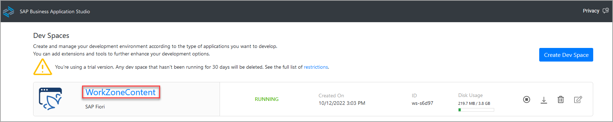
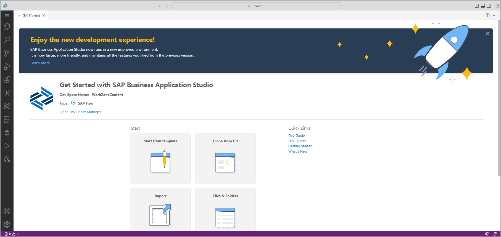

# Exercício 2.1: Configurar o SAP Business Application Studio para desenvolvimento

O SAP Business Application Studio é um ambiente de desenvolvimento disponível na SAP Business Technology Platform. Em contas de Trial mais atual, o SAP Business Application Studio é assinado por padrão, para que você possa iniciá-lo diretamente e criar seu primeiro Dev Space.

### Etapa 1: Iniciar o SAP Business Application Studio

1. Abra a [SAP BTP Trial](https://account.hanatrial.ondemand.com)  faça o login, se necessário. 
2. Clique em **SAP Business Application Studio** para Iniciar

    
    
    >**CUIDADO: Se você receber uma mensagem de erro e sua conta não tiver sido criada recentemente, será necessário adicionar uma assinatura do SAP Business Application Studio. Responda à pergunta de validação da etapa atual, vá para a próxima etapa deste tutorial e prossiga a partir daí.

2. Você pode ver um pop-up sobre a Declaração de Privacidade de Avaliação. Confirme com **OK**.

    

3. Uma nova guia é aberta. Se você não criou um espaço de desenvolvimento, a página de boas-vindas do SAP Business Application Studio é carregada.

    
 

### Etapa 2: criar um espaço de desenvolvimento

1. Na página de boas-vindas, clique em **Create Dev Space**.

 
 
2. Na tela *Create a New Dev Space*, insira  **Fiori_BTP_EXP** como nome para seu novo espaço de trabalho. Selecione **SAP Fiori** como o tipo de aplicativo que deseja criar. Em seguida, clique em **Create Dev Space**.

 
 
 > O espaço dev está no status **STARTING** . Aguarde até que esteja no estado **RUNNING** . Isso pode levar alguns minutos.

 
 
  
 
 ### Passo 3: Entre no Dev Space
 
 1. Quando o status for alterado para **RUNNING**, clique no nome do espaço de desenvolvimento **Fiori_BTP_EXP**.
 
 
 
 2. O espaço de desenvolvimento é aberto e a guia *Get Started* é exibida..

 
 
 

## Resumo

Você acessou com sucesso o SAP Business Application Studio e criou um Dev Space.

Proximo - [Exercício 2.2 - Criar um aplicativo SAP Fiori usando o SAP Business Application Studio .](../ex2.2-alternative/README.md).

