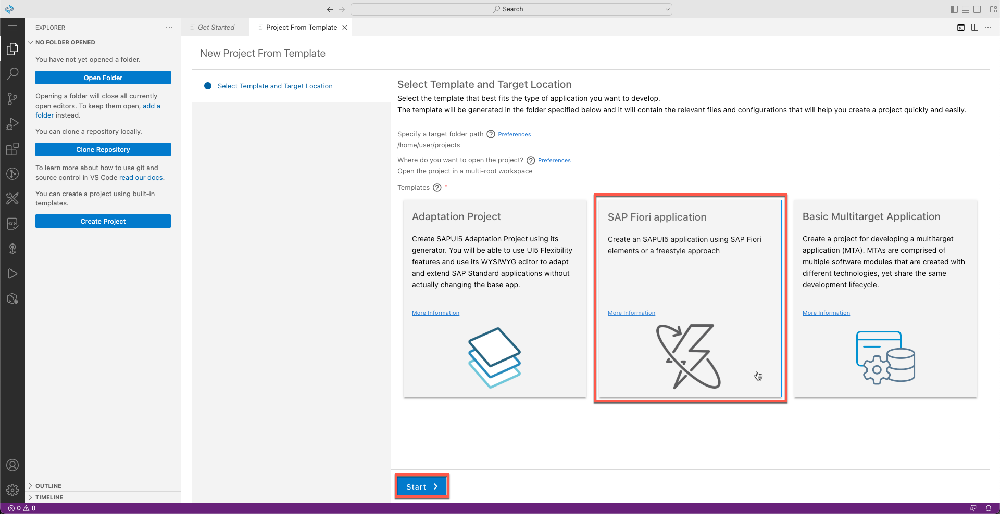
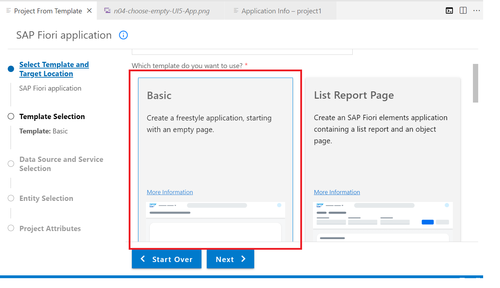
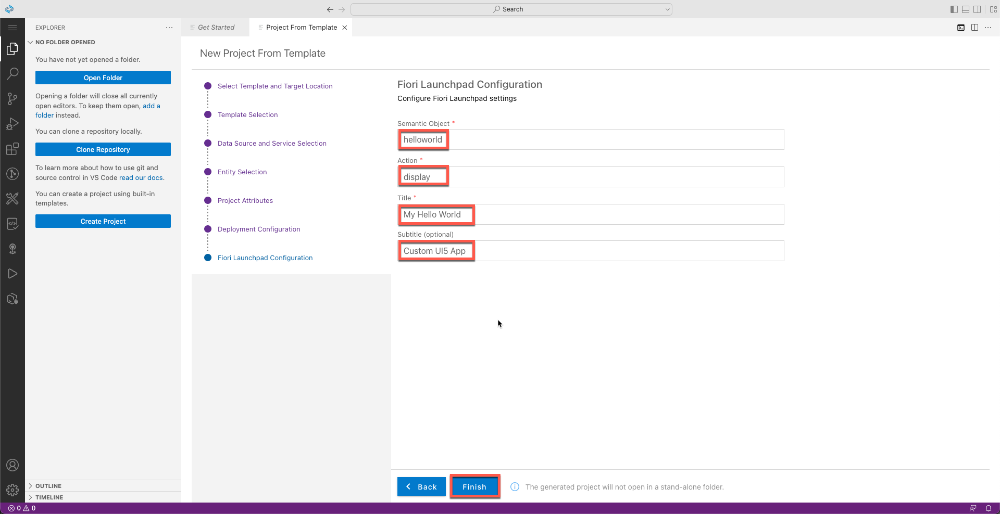

# Exercício 2.2 - Criar um aplicativo SAP Fiori usando o SAP Business Application Studio

Neste exercício, você desenvolverá um aplicativo SAPUI5 freestyle simples, seguindo as diretrizes de design do SAP Fiori.

 

### Etapa 1: criar um aplicativo SAPUI5 a partir de um modelo

Usando o assistente de criação de aplicativo, você pode, a qualquer momento, clicar no botão Voltar para voltar à etapa anterior ou clicar em uma etapa específica do assistente para voltar a essa etapa.

1. Na aba *Get Started* clique **Start from template**.

   

2. Selecione **SAP Fiori Application**, e clique em **Start**.

   

3. Na tela *Template Selection*, selecione *Application Type* **SAPUI5 freestyle**

   

4. Selecione **SAPUI5 Appliction** escolhaaa basic UI Application e clique em **Next**. 

   
   
5. Para *Data Source and Service Selection*, selecione **None** nosso aplicativo não irá consumir nenhum sistema backend. Agora clique em **Next**.

   

6. No proximo passo, você pode escolher um nome padrão para a view ou manter View1, clique em **Next**.

   

7. Selecione os seguintes **Project Attributes**, e clique em **Next**.

    | Step | Parameter | Value |
    |:-----|:----------|:------|
    | A | Module name | **`helloworld`** |
    | B | Application title | **Hello World** |
    | C | Application namespace | **técnico** |
    | D | Description | **SAPUI5 freestyle application** |
    | E | Project folder path | **`/home/user/projects`** (padrão)|
    | F | Minimum SAPUI5 version | **1.102.1** (padrão) |
    | G | Add deployment configuration | **Yes**|
    | H | Add FLP configuration | **Yes** |
    | I | Configure advanced options | **No** (padrão) |

   
    
8. Para **Deployment Configuration**, selecione **Cloud Foundry** na lista e o *Destination Name* como **None**. clique em **Next**. selecione o botão de opção **Yes** no input `Add Application to managed application router?`

   

9. Por fim, na tela **Fiori Launchpad Configuration**  selecione o seguinte e clique em **Finish**. 

    | Step | Parameter | Value |
    |:-----|:----------|:------|
    | A | Semantic Object | **helloworld** |
    | B | Action | **display** |
    | B | Title | **My Hello World** |
    | B | Subtitle (optional) | **App Customizado UI5** |

    

10. Aguarde até que a instalação das dependências do projeto seja concluída. Uma notificação de que "O projeto foi gerado" aparece na parte inferior direita da tela. Você obteria um pop-up como mostrado abaixo. Selecione  **open folder** para ver a estrutura da pasta do Projeto gerada no espaço de trabalho.
    
    
    
 Caso demore muito ou o pop-up não apareça, você também pode abrir a pasta no painel esquerdo **Open Folder**  e selecionar o caminho da pasta como `/home/user/projects/` escolha **helloworld**.

 

### Etapa 4: execute o aplicativo localmente no Dev Space

Para testar seu aplicativo, agora você pode executá-lo localmente no SAP Business Application Studio.

1.	No painel esquerdo do *Explorer* clique com o botão direito do mouse na pasta **webapp** e selecione **Preview Application** no menu de contexto.

    

2.	Selecione a primeira entrada **`Start fiori run...`** para executar o aplicativo localmente.

    

3. Agora você deve ver o aplicativo *Hello World*

 >Se o seu navegador não permitir a abertura de uma nova guia, você poderá ver uma mensagem no canto superior esquerdo com um link para permitir a abertura de uma nova guia.
   
   
   
 

## Resumo

Agora você criou um aplicativo simples. No próximo exercício, você criará o aplicativo e o implementará no Cloud Foundry.

Continue para - [Exercício 2.3 - Crie e implemente seu aplicativo ](../ex2.3/README.md)
