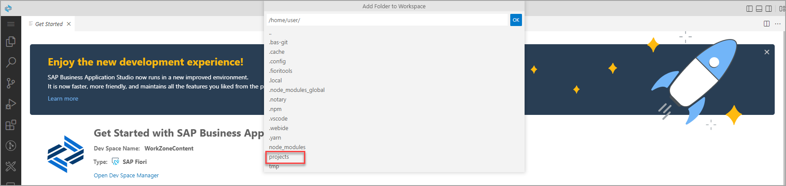
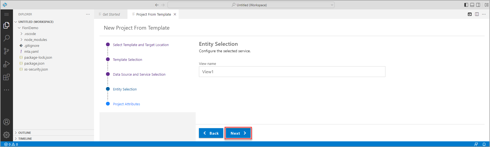

# Exercício 2.2 - Criar um aplicativo SAP Fiori usando o SAP Business Application Studio

Neste exercício, você desenvolverá um aplicativo SAPUI5 freestyle simples, seguindo as diretrizes de design do SAP Fiori. O fluxo consiste em duas partes:

1.Executar um assistente que cria uma aplicação multi-target (MTA) configurado para usar o Managed Application Router. 
2. Criar um aplicativo SAPUI5 a partir de um template e visualizá-lo.

 

### Etapa 1: criar um novo aplicativo Multitarget 

> Um MTA é necessário para criar o artefato de implementação para o ambiente SAP BTP, Cloud Foundry. Se você não estiver familiarizado com os conceitos do MTA, leia este [guia](https://www.sap.com/documents/2016/06/e2f618e4-757c-0010-82c7-eda71af511fa.html). A criação antecipada do projeto MTA não leva muito tempo e permitirá que você economize tempo posteriormente no exercício.

A janela de pesquisa na parte superior da página oferece acesso fácil para pesquisar seus arquivos. Ele também permite que você procure por comandos.

1. Digite **>**  no input marcado para para procurar um comando.

   

> Você também pode acessar a paleta de comandos por meio do ícone  **menu** no canto superior esquerdo da tela e **View > Command Palette** 

2.  Digite  `fiori: open` no campo de pesquisa e selecione o comando **Fiori: Open CF Application Router Generator**.

    

3. A guia **Application Router Generator Wizard** é aberta. Para **Application Router Configuration**,  selecione o seguinte e clique em **Finish**.

    | Etapa | Parâmetro | Valor |
    |:-----|:----------|:------|
    | A | Application router project path | **/home/user/projects** (padrão) |
    | B | MTA ID   | **`FioriDemo`** |
    | C | MTA Description  | Pode ser deixado em branco (padrão) |
    | D | Add route module | **Managed Approuter** |

    

    >Quando os usuários finais acessam um aplicativo no ambiente do Cloud Foundry, na verdade, eles acessam primeiro o Application Router. O roteador de aplicativo é usado para fornecer conteúdo estático, autenticar usuários, reescrever URLs e encaminhar ou fazer proxy de solicitações para outros microsserviços enquanto propaga as informações do usuário.

    >A recomendação é usar **Managed Application Router** que oferece muitos benefícios, quando comparado ao Standard Application Router, como economia de recursos, menor esforço de manutenção, etc. O Standard Application Router deve ser usado apenas em casos avançados, por exemplo, quando a extensibilidade do roteador de aplicativo é necessária . Mais informações estão disponíveis em [Desenvolvendo aplicativos HTML5 no ambiente Cloud Foundry](https://help.sap.com/viewer/65de2977205c403bbc107264b8eccf4b/Cloud/en-US/11d77aa154f64c2e83cc9652a78bb985.html)

4. Aguarde até que a criação do projeto seja concluída. Uma notificação de que "Os arquivos foram gerados" aparece no canto inferior direito da tela.

    

 

### Etapa 2: adicionar sua pasta a um espaço de trabalho

Seu espaço de trabalho é uma entidade que contém as configurações de seu projeto, configurações de depuração e configurações de tarefas. Você pode optar por criar um novo espaço de trabalho ou para cada projeto ou pode configurar um ambiente multi-root que contém vários projetos. Você pode saber mais sobre **Workspaces** na [documentação](https://help.sap.com/viewer/9d1db9835307451daa8c930fbd9ab264/Cloud/en-US/0919ce1ca4a342628e49c0f5e9c8cdcf.html) do SAP Business Application Studio.

1. Clique no ícone do menu e selecione **File | Add Folder to Workspace...** para abrir o dialog **Add Folder to Workspace** dialog.

    

2. O dialog **Add Folder to Workspace** é aberta no centro da janela do SAP Business Application Studio. Selecione a pasta **projects**. 

    
   
3. Agora selecione o **`FioriDemo`** projeto e clique em **OK**.

    

4. O SAP Business Application Studio é recarregado com o `FioriDemo` aberto em um espaço de trabalho ainda sem título. Na visualização do Explorer, você pode ver o `FioriDemo` , sua estrutura de pastas e arquivos.

    >A cor da barra de status muda para azul, indicando que um espaço de trabalho está aberto.

    

 

### Etapa 3: criar um aplicativo SAPUI5 a partir de um modelo

Usando o assistente de criação de aplicativo, você pode, a qualquer momento, clicar no botão Voltar para voltar à etapa anterior ou clicar em uma etapa específica do assistente para voltar a essa etapa.

1. Na aba *Get Started* clique em **Start from template**.

   

2. Selecione o tile **SAP Fiori Application**, e clique em **Start**.

   

3. Na tela *Template Selection*, selecione Tipo de aplicativo *Application Type* **SAPUI5 freestyle** no menu suspenso, selecione o modelo **SAPUI5 Appliction** e clique em **Next**.

   

4. Para *Data Source and Service Selection*, selecione **None** o menu suspenso, pois para este aplicativo, você não consumirá nenhum dado de um sistema de back-end. Em seguida, clique em **Next**.

   

5. Na próxima etapa, você pode alterar o nome da view. Mantendo View1, agora clique em **Next**.

   

6. Selecione os seguintes **Project Attributes**, e clique em **Next**.

    | Etapa | Parâmetro | Valor |
    |:-----|:----------|:------|
    | A | Module name | **`helloworld`** |
    | B | Application title | **Hello World** |
    | C | Application namespace | **técnico** |
    | D | Description | **Um aplicativo de freestyle SAPUI5 vazio** |
    | E | Project folder path | **`/home/user/projects/FioriDemo`** (padrão)|
    | F | Minimum SAPUI5 version | **1.102.1** (padrão) |
    | G | Add deployment configuration | **Yes** (padrão)|
    | H | Add FLP configuration | **Yes** |
    | I | Configure advanced options | **No** (padrão) |

   
    
7. Para  **Deployment Configuration**, mantenha os padrões **Cloud Foundry** e *Destination Name* **None**. Clique em **Next**.

   

8. Por fim, na tela **Fiori Launchpad Configuration** , selecione o seguinte e clique em **Finish**.

    | Step | Parameter | Value |
    |:-----|:----------|:------|
    | A | Semantic Object | **helloworld** |
    | B | Action | **display** |
    | B | Title | **My Hello World** |
    | B | Subtitle (optional) | Adicione uma legenda de sua escolha |

    

9. Aguarde até que a instalação das dependências do projeto seja concluída. Uma notificação de que "O projeto foi gerado" aparece na parte inferior direita da tela, a guia **Application Information** é aberta e os arquivos e a estrutura do projeto na exibição do **Explorer** são atualizados.
    
    

 

### Etapa 4: execute o aplicativo localmente no Dev Space

Para testar seu aplicativo, agora você pode executá-lo localmente no SAP Business Application Studio.

1.	Na guia *Application Information*, clique no tile **Preview Application** .Um conjunto de opções de configuração de execução é exibido na parte superior central da tela.

    

2.	Selecione a primeira entrada **`Start fiori run...`** para executar o aplicativo localmente.

    

3. Uma nova guia do navegador é aberta mostrando o aplicativo. Como você não adicionou nenhum conteúdo, o aplicativo mostra apenas um título.

    >Se o seu navegador não permitir a abertura de uma nova guia, você poderá ver uma mensagem no canto superior esquerdo com um link para permitir a abertura de uma nova guia.

    

 

## Resumo

Agora você criou um aplicativo simples. No próximo exercício, você criará o aplicativo e o implementará no Cloud Foundry.

Continue para - [Exercício 2.3 - Crie e implemente seu aplicativo ](../ex2.3/README.md)
