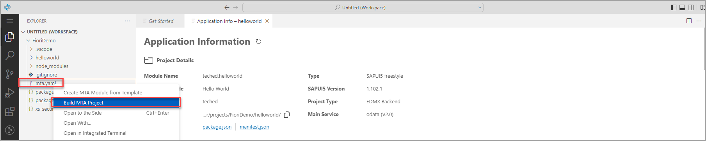
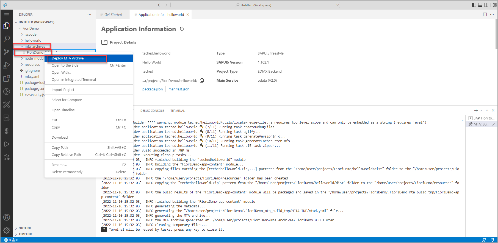
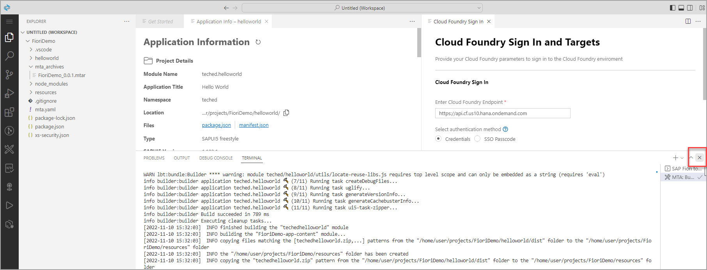
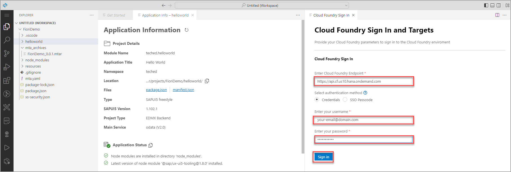
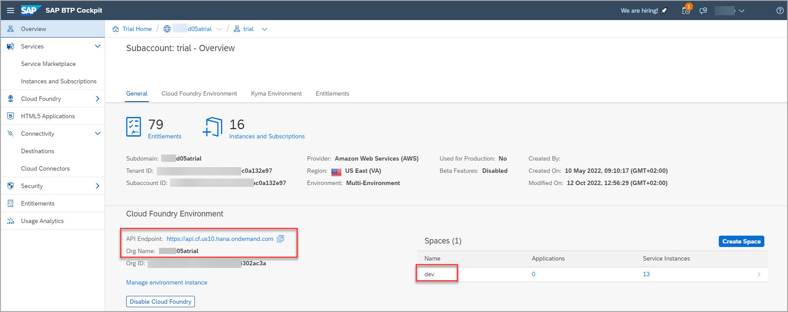
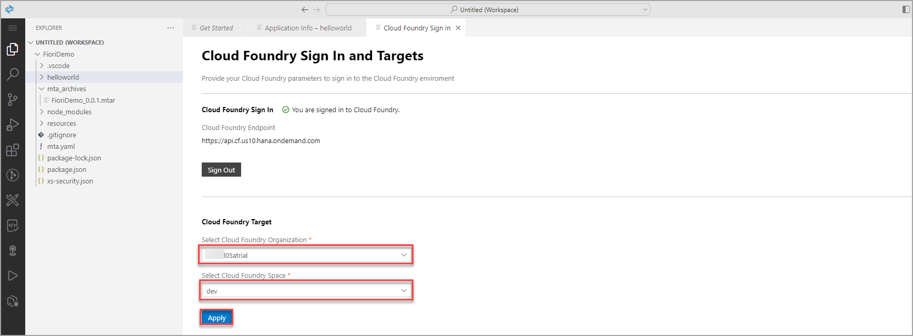
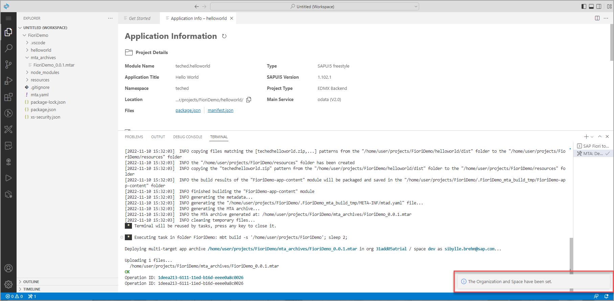
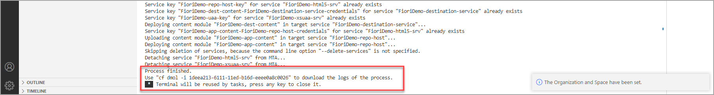
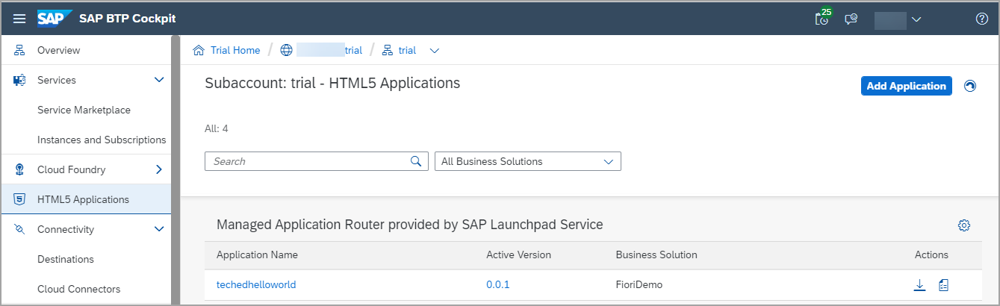

# Crie e implemente seu aplicativo SAP Fiori no SAP Business Technology Platform

Neste exercício você aprenderá:
- como construir e implantar um aplicativo para SAP BTP, ambiente Cloud Foundry
- como definir as configurações do Cloud Foundry no SAP Business Application Studio. Crie e implemente seu projeto SAP Fiori MTA em seu ambiente SAP BTP, Cloud Foundry.

 

### Etapa 1: criar o aplicativo

1. Volte para a guia com o **SAP Business Application Studio** aberto.

2. Na estrutura de pastas do seu projeto à esquerda, clique com o botão direito do mouse no `mta.yaml` e selecione **Build MTA Project**.

> O processo de construção cria um arquivo arquivo multi-target (`MTAR`) f que empacota todos os módulos do projeto para implantação. 
> Você pode encontrar o `MTAR` arquivo na pasta `FioriDemo/mta_archives`.

 

### Etapa 2: Implemente seu aplicativo no Cloud Foundry

1. Abra a pasta **mta_archives** clique com o botão direito do mouse no arquivo **FioriDemo_0_0_1.mtar** e  **Deploy MTA Archive**.

> Antes de implementar seu novo aplicativo, você precisa fazer login no Cloud Foundry e selecionar a conta de destino na qual deseja implementar o aplicativo. Portanto, uma guia **Cloud Foundry Sign In** é aberta.

2. Se necessário, feche o *Terminal* para ver a guia Login completa.

3. Selecione o endpoint da API, forneça suas credenciais e clique em **Sign in**.

    
    
    > Se você não tiver certeza de qual terminal de API, organização e espaço, poderá encontrar estas informações na Visão geral do SAP BTP Cockpit.
    > 
    > 

4. Selecione a organization, o space e clique em **Apply**.

       

    

5. Aguarde a conclusão da implantação.

    >O processo de implantação costuma ser bastante rápido. Quando o processo de implantação estiver concluído, as notificações **Process finished** e **Terminal will be reused by tasks** aparecerão na parte inferior do **Terminal**.

    > 

    >Você também pode encontrar seus aplicativos implantados no SAP BTP Cockpit na área Aplicativos HTML5 e iniciá-los a partir daí.
    >
    >

## Resumo

Com isso, você concluiu com sucesso a implementação do seu aplicativo SAP Fiori no SAP BTP usando o SAP Business Application Studio.
Continue para - [ Exercício 2.4 - Integrar seu aplicativo SAPUI5 em seu site](../ex2.4/README.md)

