# Integre seu aplicativo SAPUI5 ao seu Launchpad

Neste exercício, você aprenderá como usar um aplicativo SAPUI5 desenvolvido de forma personalizada que foi implantado no ambiente SAP BTP, Cloud Foundry em seu Launchpad.

## Pré-requisitos
 - Você já criou o Launchpad `JobCore`
 - Você implementou seu aplicativo SAPUI5 (incluindo as propriedades de navegação) no ambiente SAP BTP, Cloud Foundry.

Depois de implantar seu aplicativo SAPUI5 no SAP BTP, ele fica disponível para ser adicionado ao Launchpad.

 

### Passo 1: Buscar conteúdo atualizado usando o Provider Manager

1. Volte para o ambiente de administração do SAP Build Work Zone, standard edition.

2. Clique no ícone **Channel Manager** para visualizar os content channels. Nesta tela, os administradores podem criar canais de conteúdo, por exemplo, para consumir conteúdo federado de um sistema provedor como o SAP S/4HANA.

    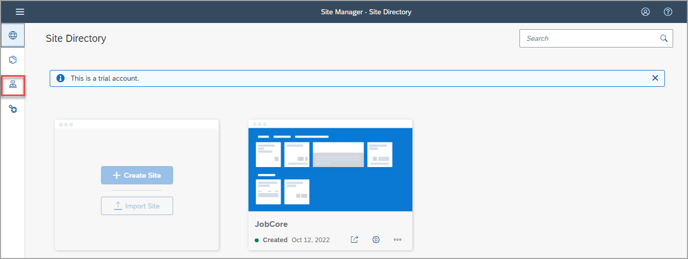

3. Na linha **HTML5 Apps**, clique no ícone **Update content** para consumir todos os aplicativos implantados recentemente para integração. Você verá uma mensagem informando que o conteúdo está sendo atualizado. Aguarde até que o status seja definido como **Updated**.

    >O canal **HTML5 Apps** está disponível por padrão. Qualquer aplicativo usando o roteador de aplicativo gerenciado implantado no SAP BTP é adicionado automaticamente como conteúdo a este canal.

    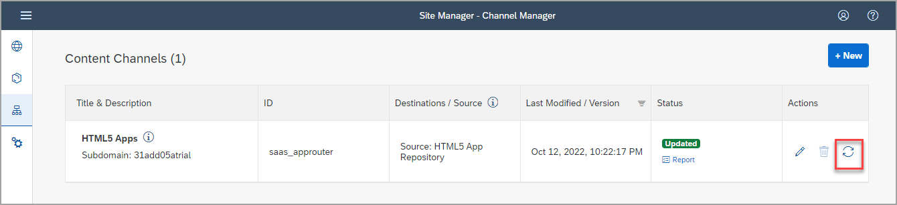

 

### Etapa 2: adicione seu aplicativo SAPUI5 implantado ao seu conteúdo

1. Clique no ícone Content Manager no painel lateral para abrir **Content Manager**.

    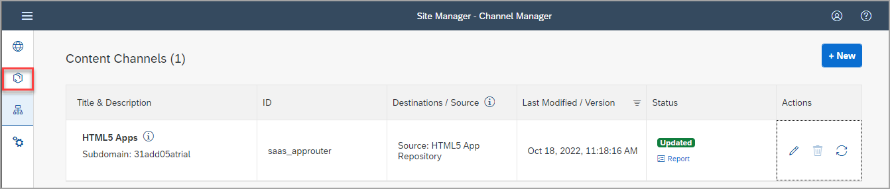

    >O **Content Manager**  tem duas abas: **My Content** , onde você pode configurar manualmente os itens de conteúdo e visualizar quaisquer outros itens de conteúdo disponíveis, e o  **Content Explorer**, onde pode explorar o conteúdo exposto de canais de conteúdo disponíveis, selecionar o conteúdo e adicioná-lo ao seu próprio conteúdo .

2. Clique na aba **Content Explorer** para ver os provedores de conteúdo disponíveis.

    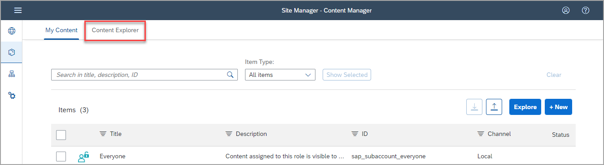

3. Selecione o provedor **HTML5 Apps**.

    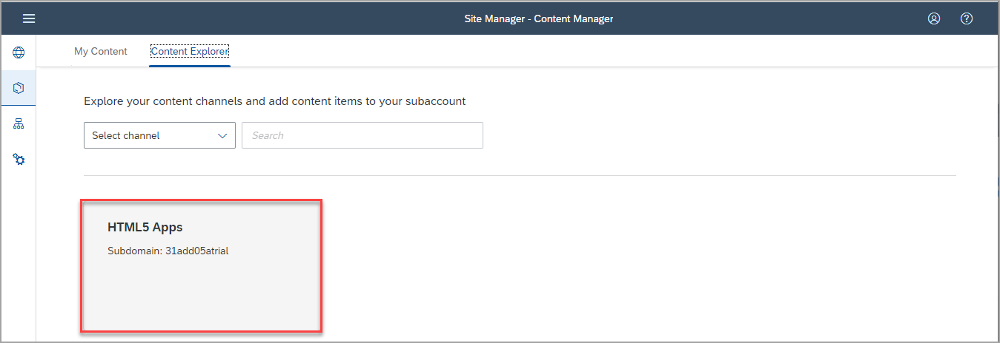

4. Você verá que seu `Hello World`já existe neste provedor. Selecione-o e clique em **+ Add to My Content**.

    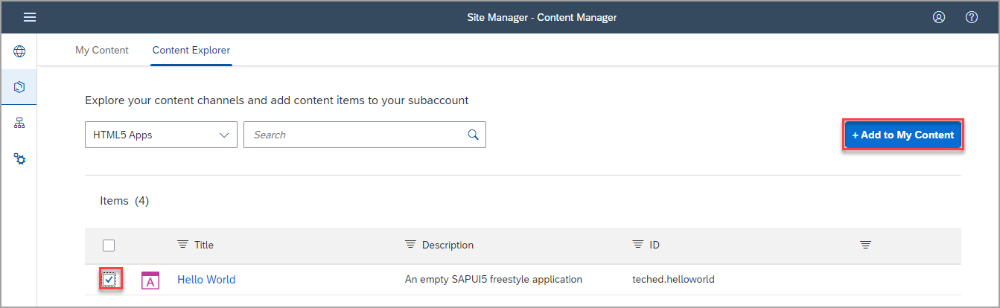

5. Clique na guia **My Content**.

    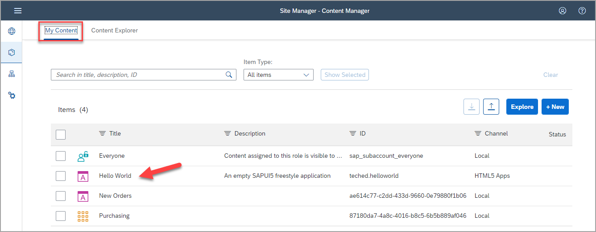   

 

### Etapa 3: crie um grupo e atribua um aplicativo a ele

Nesta etapa, você criará um novo grupo e atribuirá o `Hello World` a ele.

1. Clique em **+ New** no **Content Manager** e selecione **Group** para criar um novo grupo.

    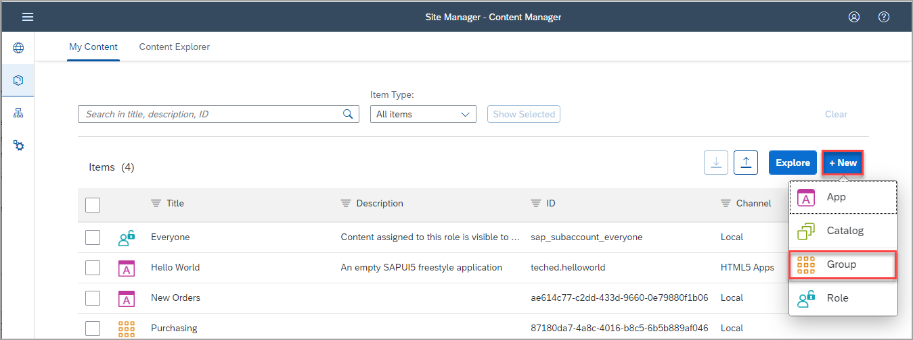

2. Digite `Simple Apps` como **Title**.

3. No painel **Assignments**  à direita, clique no input indicado e veja a lista de aplicativos.  

4. Ao lado do `Hello World` , clique em **+** para atribuir seu app no grupo.

    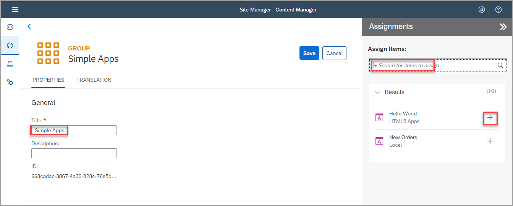

    Observe que o icone muda.

4. clique em **Save**.

    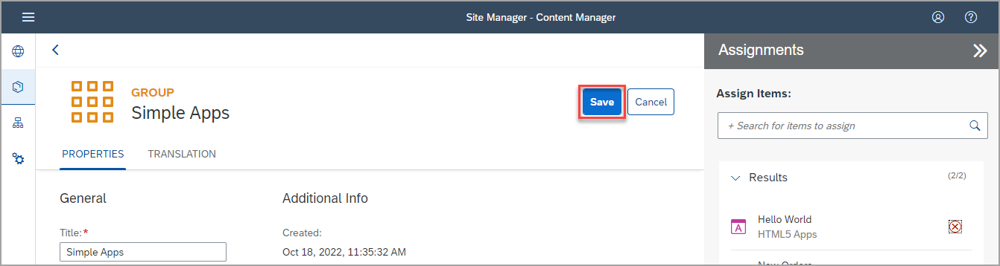

 

### Etapa 4: atribuir o aplicativo a Role Everyone

Nesta etapa, você atribuirá o `Hello World` a role `Everyone`. Esta é uma role padrão - o conteudo atribuido a role `Everyone` é visivel para todos usuários. Além de que a role `Everyone` por padrão é atribuida a todos os launchpads não sendo necessário cria-la.

1. Clique no ícone Voltar para voltar ao **Content Manager**.

    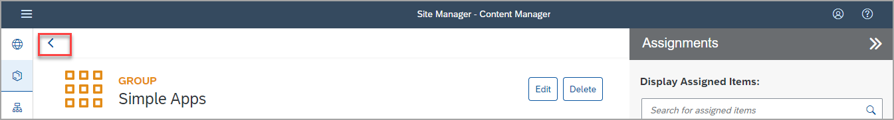

2. Clique na role `Everyone`.

    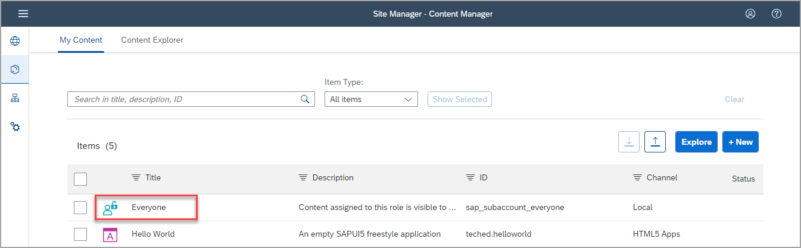

3. Clique em **Edit**.

    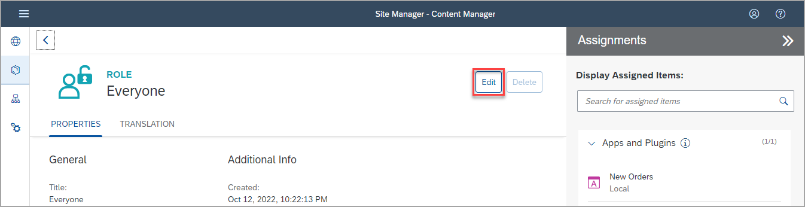

4. Clique no input **Assignments** e irá aparecer a lista abaixo com todos os aplicativos disponíveis 

5. Atribua o app `Hello World`.

6. Clique em **Save**.

    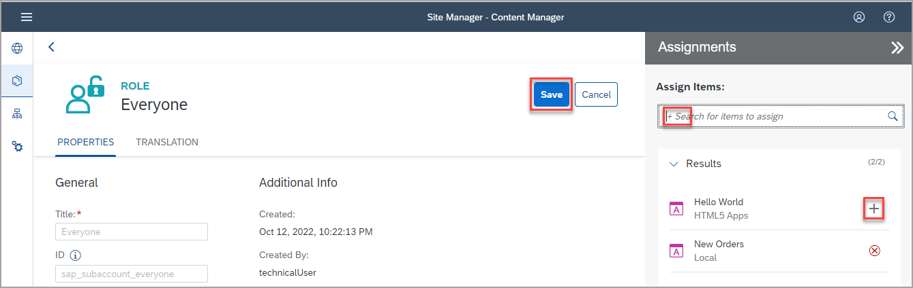

 

### Etapa 5: revise seu site

1.  Clique em **Site Directory** para abrir o Launchpad Directory.

    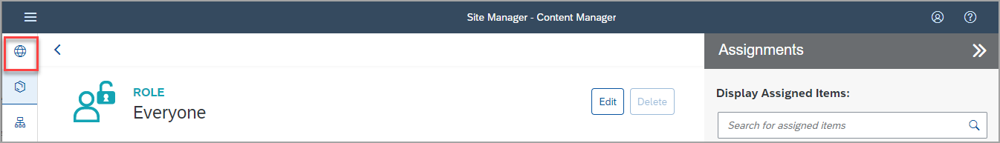

2. Clique em **Go to site**. O Launchpad é aberto no navegador.

    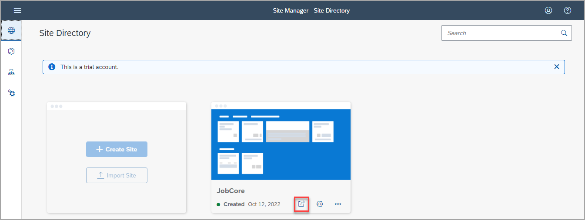

    Você verá os dois aplicativos que criou em seu Launchpad. No grupo `Simple Apps` , verá o `Hello World` app that you just created.

    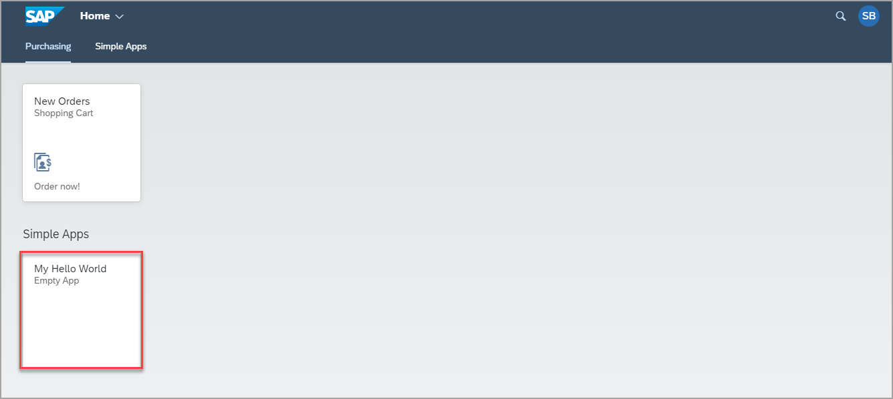

3. Clique no aplicativo para iniciá-lo. Você vê um aplicativo vazio mostrando apenas o título `Hello World`.

    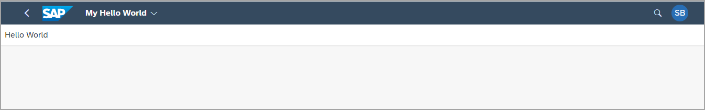

 

## Resumo

Com isso, você adicionou com sucesso seu aplicativo SAP Fiori ao seu site SAP Build Work Zone.

Continue para - [Exercício 3 - Acesse seu site com o SAP Mobile Start](../../ex3/README.md)

