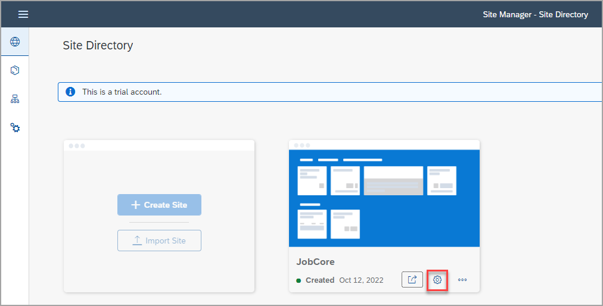
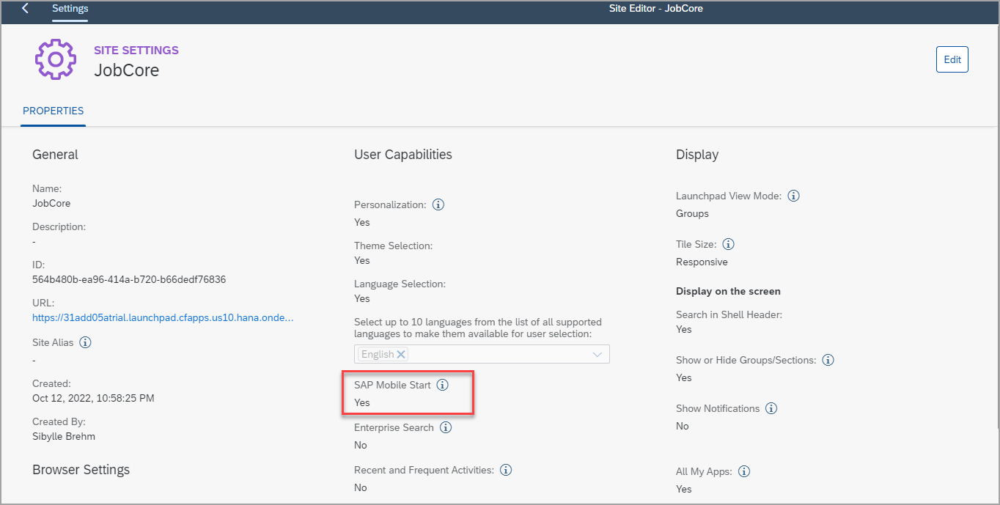
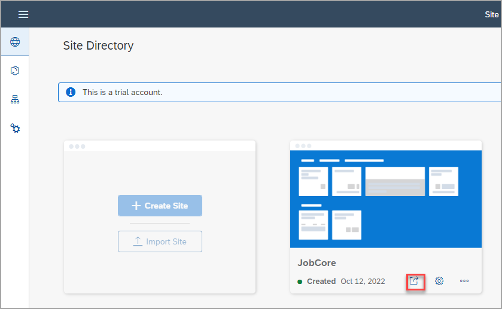
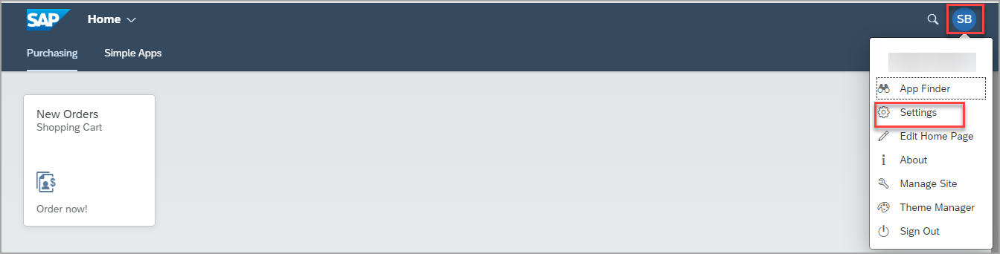
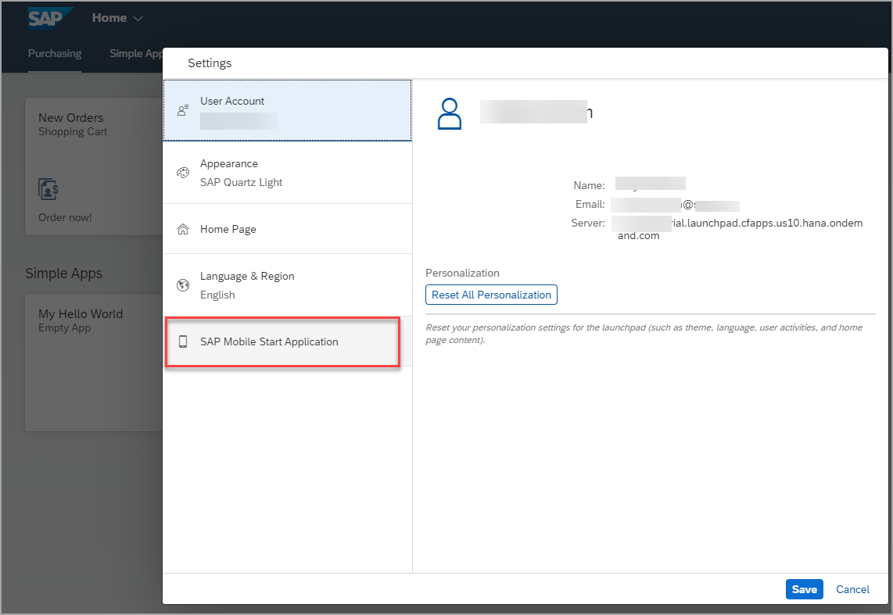
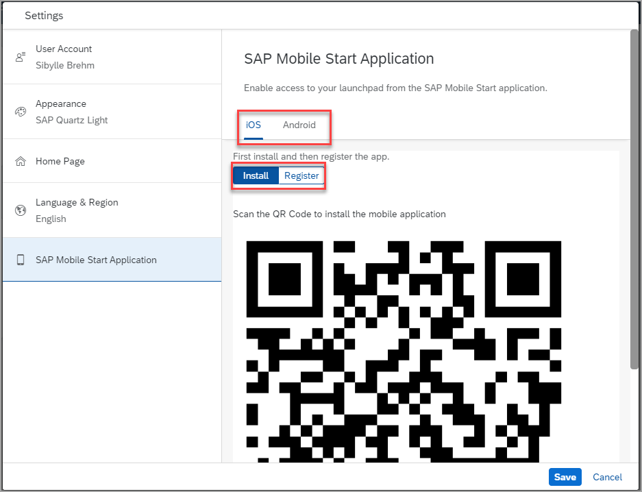
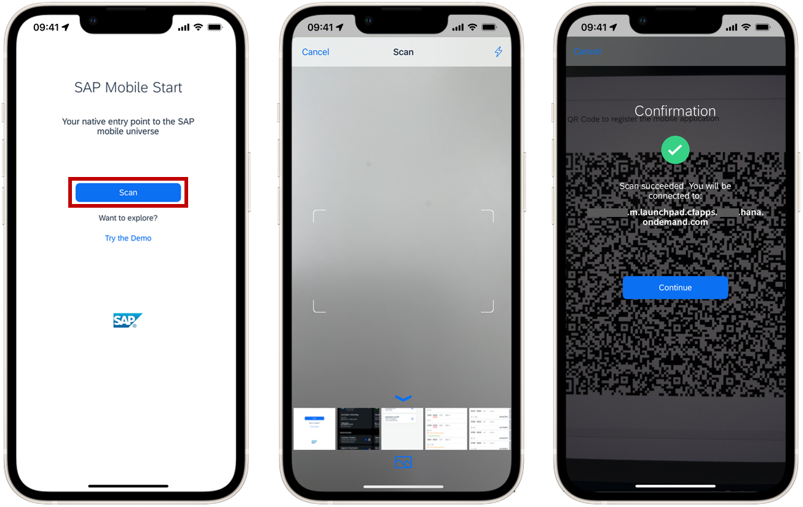
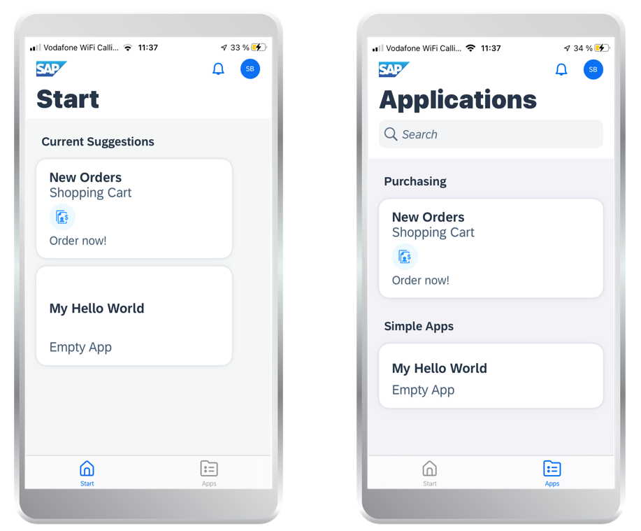

# Exercício 3: Acesse seu site com o SAP Mobile Start

Neste exercício, você aprenderá como conectar o aplicativo nativo SAP Mobile Start ao seu site.

 

### Etapa 1: ativar o SAP Mobile Start nas configurações do site

1.  Volte para o Site Directory.

2.  Clique no ícone de configurações no bloco 'JobCore' para abrir as configurações do site.
    

3.  Nas configurações do site, certifique-se de que o SAP Mobile Start esteja ativado.

    

4.  Se não estiver, clique em editar, defina a alternância do SAP Mobile Start como **YES**, e clique em **Save**.

5.  Volte ao Site Directory usando o ícone Voltar .

 

### Etapa 2: acesse os códigos QR nas configurações do usuário

1.  Abra seu site por meio do ícone **Go to site** no tile **JobCore*.

    

2.  No site, abra o menu do usuário por meio das iniciais do usuário no canto superior direito. Em seguida, escolha **Settings**.

    

3.  Na tela Configurações, selecione a aba **SAP Mobile Start Application**.

    

   (Se a opção não estiver disponível, certifique-se de que o SAP Mobile Start esteja habilitado nas configurações do site (etapa 1), também pode ser necessário atualizar o site para que suas alterações se tornem ativas.)

    Nesta tela você pode selecionar seu tipo de dispositivo (Android ou iOS) e alternar entre dois QR Codes através do botão de alternância:

      1. **Install**:
      Este QR-Code pode ser usado para instalar o aplicativo SAP Mobile Start em seu dispositivo. É um link direto para Apple app store.

      2. **Register**:
      Este QR-Code é usado posteriormente no aplicativo SAP Mobile Start para registrá-lo em seu site.

    

 

### Passo 3: Instale o SAP Mobile Start no seu dispositivo

Use o QR-Code de instalação da Etapa 2 para instalar o SAP Mobile Start em seu dispositivo. Como alternativa, você pode procurar o SAP Mobile Start nas respectivas App Stores.

 

### Etapa 4: integração do SAP Mobile Start

1.	Use a alternância nas configurações *SAP Mobile Start Application* alternando o código QR **Register** QR-code. Scroll down if required.

2. Abra o aplicativo SAP Start em seu dispositivo, pressione o botão **Scan** e certifique-se de permitir o acesso à câmera.

    (Abaixo do botão de digitalização, você encontrará a opção de entrar no modo de demonstração. Isso demonstrará como é um site de barra de ativação totalmente configurado com a adição do SAP Task Center.)

3.	Em seguida, use a câmera do seu dispositivo para escanear o **Register QR-Code** nas configurações do usuário do launchpad. Se a verificação for bem-sucedida, você poderá continuar com o processo de integração.

    

4.  Siga o processo de integração guiado no aplicativo:

  - Faça login com seu usuário

  - Aceite o Contrato de licença do usuário final e a Declaração de privacidade de dados

  -	Dependendo da sua configuração, pode ser necessário criar uma senha/permitir a autenticação biométrica.

   Depois de concluir o processo de integração, você será direcionado para a tela **Start** screen.

 

### Etapa 5: experimente o aplicativo

1.	Você pode usar os ícones de navegação na parte inferior para se mover entre as telas Iniciar e Aplicativo. A tela inicial oferece uma visão geral para acesso rápido aos seus aplicativos mais usados. A tela Aplicativo lista todos os grupos e aplicativos do site. Se você configurar a integração do SAP Task Center em seu site, verá um ícone adicional  **To Do** na parte inferior, onde poderá encontrar todos os itens do fluxo de trabalho.

2.  Ambas as telas, a tela Iniciar e Aplicativo, têm o ícone de notificação e o ícone de usuário (configurações). Use-os para acessar a seção de notificação ou a página Perfil e configurações.

3.  Na tela Aplicativo, você pode usar a barra de pesquisa para encontrar aplicativos específicos.

4.  Você pode clicar nos blocos de aplicativos para abrir o aplicativo de sua escolha.

5.	No perfil e nas configurações, você pode escolher **Sign Out** para retornar à tela inicial de integração, caso queira se conectar a um site diferente.

## Resumo

### Parabéns! Você concluiu com sucesso este workshop completo para configurar o SAP Build Work Zone, standard edition!

se vc quiser saber mais sobre o SAP Build Work Zone, visite a [Comunidade SAP Build Work Zone](https://community.sap.com/topics/mobile-experience/start). Mais informações sobre o SAP Mobile Start estão disponíveis na [Comunidade SAP Mobile Start](https://community.sap.com/topics/mobile-experience/start).

Volte para o [conteúdo principal](../../README.md).
